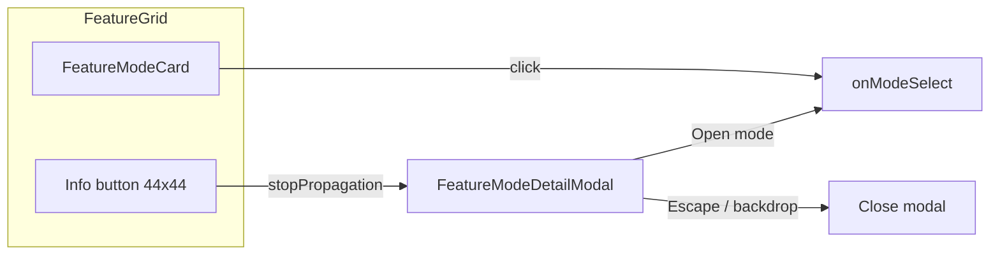

# TABLEFIX — Feature Grid Tile Description Fix

---

**Phase**: Dashboard Zone 4 polish  
**Type**: UX enhancement (progressive disclosure)  
**Dependencies**: Phase 1 Dashboard (`FeatureGrid`, `FeatureModeCard`)  
**Assignee**: Cursor (AI IDE Agent)  
**Risk**: Low — dashboard-only UI; no API or mode-registry changes

---

## Executive Summary

Dashboard **Feature Access Grid** tiles truncate every mode description to one line (`line-clamp-1`) inside narrow columns (`minmax(140px, 1fr)`). Sighted users cannot read copy such as _"Bounded hypothesis → change → measure loops"_ or _"Start a th3rdai-harness project to build apps and tools"_ even though full text exists in `aria-label`.

**TABLEFIX** adds progressive disclosure: **card click still navigates to the mode**; a **44×44 info control** opens a **detail modal** with the full description and an explicit **Open {label}** action.

---

## Problem

| Location                                       | Issue                                    |
| ---------------------------------------------- | ---------------------------------------- |
| `src/components/dashboard/FeatureModeCard.jsx` | `line-clamp-1` on `mode.desc`            |
| `src/components/dashboard/FeatureGrid.jsx`     | Inline `minmax(140px, 1fr)` — too narrow |
| `src/App.jsx` `MODES[].desc`                   | Long strings always ellipsize on tiles   |

Primary navigation must remain one-click on the card body.

---

## Scope

**In scope**

- Zone 4 components only (`FeatureGrid`, `FeatureModeCard`, new `FeatureModeDetailModal`)
- Responsive grid classes aligned with `DASHBOARD.md` breakpoints
- Playwright coverage for info → modal → open flow
- Short note in `DASHBOARD.md` Zone 4

**Out of scope**

- "Show More" collapsible builder/secondary groups
- Keyboard arrow navigation between cards
- Changes to `MODES` data or `DashboardView` props contract

---

## Solution



### Why not alternatives

| Option                           | Verdict                                  |
| -------------------------------- | ---------------------------------------- |
| `line-clamp-2` + `title` tooltip | Still truncates long copy; poor touch UX |
| Browse-all sheet                 | Heavy; duplicates grid                   |
| Full-description list layout     | Breaks compact bento grid                |

---

## File Map

| File                                                  | Action                                        |
| ----------------------------------------------------- | --------------------------------------------- |
| `src/components/dashboard/FeatureModeDetailModal.jsx` | **New** — glass overlay modal                 |
| `src/components/dashboard/FeatureModeCard.jsx`        | **Modify** — relative wrapper, info button    |
| `src/components/dashboard/FeatureGrid.jsx`            | **Modify** — `detailMode` state, modal render |
| `tests/ui/dashboard-feature-grid.spec.js`             | **New** — Playwright spec                     |
| `DASHBOARD.md`                                        | **Modify** — Zone 4 card design note          |

---

## UI Specification

### Modal (`FeatureModeDetailModal.jsx`)

Pattern: fixed centered glass overlay (see `ConfirmRunModal.jsx`), not draggable `RenameModal.jsx`.

- Overlay: `fixed inset-0 z-50 bg-black/60 backdrop-blur-sm`
- Panel: `glass rounded-2xl border border-indigo-500/30 max-w-md w-full mx-4`
- Header: Lucide icon via `icon-map.js`, `mode.label` as `h2`
- Body: full `mode.desc` (no clamp)
- Actions:
  - Primary: **Open {label}** — `btn-neon`
  - Secondary: **Cancel**
- Close: Escape, backdrop click, Cancel
- A11y: `role="dialog"`, `aria-modal="true"`, `aria-labelledby`, focus first action on open, restore focus to info button on close

### Card (`FeatureModeCard.jsx`)

- Wrapper: `relative` (invalid HTML forbids button inside button)
- Main `<button>`: full tile, navigate on click
- Info `<button>`: `absolute top-2 right-2`, min 44×44, Lucide `Info`, `stopPropagation`, `aria-label="More about {label}"`
- Preview description: keep `line-clamp-1` on tile

### Grid (`FeatureGrid.jsx`)

Replace inline style with:

```css
grid grid-cols-2 sm:grid-cols-3 lg:grid-cols-4 xl:grid-cols-6 gap-4
```

State: `detailMode: Mode | null` local to `FeatureGrid`.

---

## Acceptance Criteria

- [ ] Every grid tile shows label + truncated preview
- [ ] Info opens modal with **full** description (no clamp)
- [ ] Card body click switches mode (leaves dashboard)
- [ ] Info click does **not** switch mode
- [ ] Modal **Open {label}** switches mode and closes modal
- [ ] Escape / backdrop / Cancel close without navigation
- [ ] Info control touch target ≥ 44×44 px
- [ ] Playwright spec passes
- [ ] `npm run validate:static` passes

---

## Test Plan

### Manual

1. Open Home (dashboard) in Electron and browser
2. Click info on **Experiment** and **Build** tiles — full description visible
3. Cancel modal — still on dashboard
4. Open modal → **Open {label}** — mode switches

### Automated

`tests/ui/dashboard-feature-grid.spec.js`:

1. Dismiss splash/onboarding; open dashboard via `mode-tab-dashboard` or `cc-show-dashboard`
2. Click info on a mode with a long description
3. Assert dialog visible with full text
4. Cancel — assert still on dashboard (`Feature Access Grid` visible)
5. Re-open → **Open** — assert mode tab active

Run:

```bash
npm run test:ui -- tests/ui/dashboard-feature-grid.spec.js
npm run validate:static
```

---

## Implementation Checklist

- [ ] `FeatureModeDetailModal.jsx` — modal shell + a11y
- [ ] `FeatureModeCard.jsx` — info button + refs
- [ ] `FeatureGrid.jsx` — state wiring + responsive grid
- [ ] `dashboard-feature-grid.spec.js`
- [ ] `DASHBOARD.md` Zone 4 update
- [ ] Archon task created (CodeCompanion project)

---

## Risk

**Low.** Isolated dashboard components. Main regression: accidental mode switch when clicking info — mitigated by separate button + `stopPropagation`.
