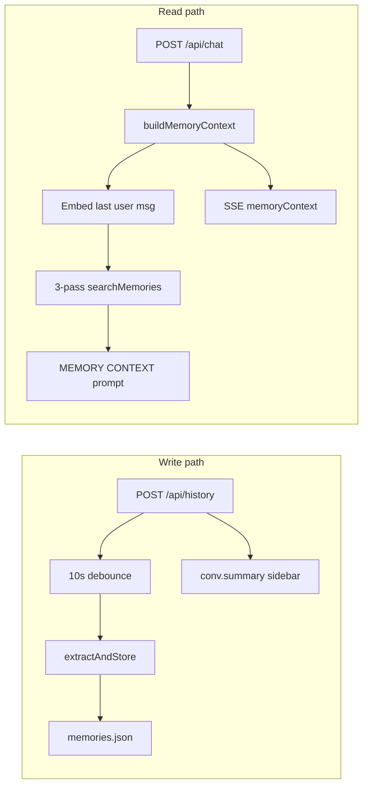

# MEMORYFIX — Implementation plan for Code Companion embedding memory

**Status:** iteration 4 — plan-reviewer NEEDS REVISION → READY (doc updated; no code shipped yet)
**Source:** Memory system review (2026-05-24) + codebase audit of [`lib/memory.js`](lib/memory.js), [`routes/history.js`](routes/history.js), [`lib/chat-post-handler.js`](lib/chat-post-handler.js), [`routes/memory.js`](routes/memory.js), [`src/components/SettingsPanel.jsx`](src/components/SettingsPanel.jsx), [`src/components/MemoryPanel.jsx`](src/components/MemoryPanel.jsx), [`docs/ENVIRONMENT_VARIABLES.md`](docs/ENVIRONMENT_VARIABLES.md), [`.planning/codebase/CONCERNS.md`](.planning/codebase/CONCERNS.md)
**Target release:** v1.7.x — Phases 1a–2 unflagged; Phase 3 flag-gated (`memory.enhancedRecall`, default `false`); Phases 4–5 optional v1.7.x or v1.8

**Related:** [CTXFIX.md](CTXFIX.md) (context window / token budget) — orthogonal to long-term memory.

---

**Implementation gate (read before coding)**

- [ ] Three-tier recall documented and tested: **agent** (`fact`, `source: null`), **project** (`project`/`pattern`, `projectKey`), **conversation** (`summary`, `source = conversationId`).
- [ ] [`lib/config.js`](lib/config.js) defaults match [`.cc-config.json.example`](.cc-config.json.example) memory keys: `enabled`, `embeddingModel`, `maxContextTokens`, `recallThreshold`, `autoExtract`, `maxMemories`, `enhancedRecall` (Phase 3).
- [ ] No hardcoded `500` in `extractAndStore` — read `config.memory.maxMemories`.
- [ ] `POST /api/memory/reembed` implemented (Settings UI already calls it at [`SettingsPanel.jsx:393`](src/components/SettingsPanel.jsx)).
- [ ] `_persistToDisk` debounced; `flushMemoryToDisk()` registered on process shutdown in [`server.js`](server.js).
- [ ] `searchMemories` skips records where `embeddingModel !== resolveEmbeddingModel(config)`.
- [ ] SSE `memoryContext.items` includes `id` before forget-from-chip ships (Phase 3).
- [ ] GitNexus impact on `extractAndStore`, `buildMemoryContext`, `_persistToDisk`, `searchMemories` before edits.
- [ ] `addMemory()` accepts optional `topics` on summary records only.

**Locked decisions (do not re-litigate during implementation)**

1. **`topics`** — store as optional `topics: string[]` on **summary** memory records only. No new `topic` memory type.
2. **`conv.summary`** — sidebar blurb on conversation JSON stays separate from embedded memory summaries. Do not merge pipelines in v1.
3. **Delete cascade** — deleting a conversation removes memory summaries where `source === conversationId` only. Global facts and project patterns (`source: null`) persist by design.
4. **Compact** — enhance `compactMemories()` to minify JSON and prune orphans; do not wrap the current persist-only stub.

**Plan-reviewer iteration log (abbreviated)**

| Iter | Verdict                | Key fixes                                                                                                                                      |
| ---- | ---------------------- | ---------------------------------------------------------------------------------------------------------------------------------------------- |
| 1    | NEEDS REVISION         | `compactMemories()` is persist-only; Re-embed UI 404; SSE items lack `id`; topics storage locked                                               |
| 2    | NEEDS REVISION         | `saveMemoryConfig` omits `maxMemories`; `updateMemory` allowedFields incomplete; stale `embeddingModel` not filtered; Phase 1 split into 1a/1b |
| 3    | READY                  | Ship order, config keys, test commands aligned; gaps G1–G14 verified                                                                           |
| 4    | NEEDS REVISION → fixed | addMemory/topics task; nearMisses spec; Phase 4 metadata owner; test fixes                                                                     |

---

## Goals

Improve embedding memory correctness, recall quality, extraction efficiency, persistence performance, and user trust. Each phase is independently shippable.

**Ship order:** **1a → 1b → 2 → 3 → 4 → 5** (low-risk correctness first; UX trust last).

1. **Correctness** — wire config, fix docs, persist topics, implement dead re-embed API.
2. **Recall quality** — multi-turn query, scored ranking, near-miss hints (flag-gated).
3. **Extraction efficiency** — incremental extract, rolling memory summary upsert.
4. **Performance** — debounced disk writes, meaningful compact.
5. **User trust** — forget-from-chip, pin memories.

**Out of scope (v1 MEMORYFIX):** external vector DB (Chroma/Qdrant); encryption at rest; mode-specific auto-extract (Security/Builder); replacing `maxContextTokens * 4` char budget; merging `conv.summary` into memory pipeline.

---

## Current architecture

Embedding memory stores Ollama vectors in `${CC_DATA_DIR}/memory/memories.json`. Retrieval runs before each chat stream; extraction runs after conversation saves (debounced).



### Three-tier recall ([`lib/memory.js:622-643`](lib/memory.js))

| Tier         | Types                                   | Scope                                                               | When injected                   |
| ------------ | --------------------------------------- | ------------------------------------------------------------------- | ------------------------------- |
| Agent        | `fact`                                  | `source: null`                                                      | Every chat (Pass 1)             |
| Project      | `project`, `pattern`                    | `projectKey` from `deriveProjectKey(chatFolder \|\| projectFolder)` | When active folder set (Pass 2) |
| Conversation | `summary` (+ `topics[]` after Phase 1a) | `source = conversationId`                                           | Same thread only (Pass 3)       |

**Project key derivation** ([`lib/memory.js:30-37`](lib/memory.js)): folder basename lowercased, non-alphanumeric → `-`. Example: `/Users/james/Projects/CodeCompanion` → `codecompanion`.

### Two summary systems (G13 — do not conflate)

| Mechanism        | Storage                                                              | Embedding | Purpose                          |
| ---------------- | -------------------------------------------------------------------- | --------- | -------------------------------- |
| `conv.summary`   | Conversation JSON ([`routes/history.js:318-360`](routes/history.js)) | No        | Sidebar list blurb (~500 chars)  |
| Memory `summary` | `memories.json`                                                      | Yes       | Semantic recall in chat (Pass 3) |

Phase 4 rolling upsert applies to **memory summaries only**.

### Existing UX

- **Settings → Memory** — enable, embedding model, thresholds, auto-extract, stats, Manage Memories, Re-embed All ([`SettingsPanel.jsx`](src/components/SettingsPanel.jsx)).
- **Memory chip** — toolbar dropdown showing recalled items ([`src/App.jsx:1485-1531`](src/App.jsx)).
- **MemoryPanel** — browse, search, edit, delete ([`MemoryPanel.jsx`](src/components/MemoryPanel.jsx)).

### Config keys today

| Key                | `lib/config.js` default | `.cc-config.json.example` | Runtime read            |
| ------------------ | ----------------------- | ------------------------- | ----------------------- |
| `enabled`          | `false`                 | `false`                   | Yes                     |
| `embeddingModel`   | `""`                    | `""`                      | Yes                     |
| `maxContextTokens` | `500`                   | `500`                     | Yes                     |
| `recallThreshold`  | **missing (G2)**        | `0.6`                     | Yes (Settings saves)    |
| `autoExtract`      | `true`                  | `true`                    | Yes                     |
| `maxMemories`      | `500`                   | `500`                     | **No — hardcoded (G1)** |
| `enhancedRecall`   | **missing**             | **missing**               | Phase 3                 |

---

## Known gaps (verified G1–G14)

| ID  | Issue                                          | Evidence                                                                                                                        | Fix      |
| --- | ---------------------------------------------- | ------------------------------------------------------------------------------------------------------------------------------- | -------- |
| G1  | `maxMemories` ignored at runtime               | `const maxMemories = 500` at [`lib/memory.js:425`](lib/memory.js)                                                               | 1a       |
| G2  | `recallThreshold` missing from config defaults | Example [`.cc-config.json.example:42`](.cc-config.json.example); defaults [`lib/config.js:123-128`](lib/config.js)              | 1a       |
| G3  | `topics` extracted, never stored               | Schema [`lib/memory.js:355-357`](lib/memory.js); no store after line 521                                                        | 1a       |
| G4  | Docs claim per-conversation-only recall        | [`docs/ENVIRONMENT_VARIABLES.md:38-44`](docs/ENVIRONMENT_VARIABLES.md), [`docs/AGENT-READINESS.md:58`](docs/AGENT-READINESS.md) | 1a       |
| G5  | Sync disk write every mutation                 | [`_persistToDisk`](lib/memory.js:320-325) on every add/update/dedup                                                             | 2        |
| G6  | Last user message only for query embed         | [`buildMemoryContext:594-608`](lib/memory.js)                                                                                   | 3        |
| G7  | Extraction uses last 20 messages               | [`extractAndStore:375-376`](lib/memory.js)                                                                                      | 4        |
| G8  | `compactMemories()` is persist-only            | [`lib/memory.js:92-97`](lib/memory.js) — no prune/shrink                                                                        | 2        |
| G9  | `projectKey` = folder basename only            | [`deriveProjectKey`](lib/memory.js:30-37)                                                                                       | Appendix |
| G10 | CONCERNS deactivated-entry bloat               | [`_loadFromDisk`](lib/memory.js:305-311) strips `active: false` on load — issue largely stale                                   | doc note |
| G11 | Re-embed UI calls missing API                  | [`SettingsPanel.jsx:393`](src/components/SettingsPanel.jsx) vs no route in [`routes/memory.js`](routes/memory.js)               | 1b       |
| G12 | SSE items lack memory `id`                     | [`chat-post-handler.js:875`](lib/chat-post-handler.js) `{ type, content }` only                                                 | 3        |
| G13 | Dual summary systems undocumented              | See table above                                                                                                                 | this doc |
| G14 | Stale embeddings after model change            | `searchMemories` no `embeddingModel` filter                                                                                     | 1b       |

---

## Phase 1a — Config, docs, topics (ship first; no flag)

**Risk:** low — wiring and documentation; no behavioral change to recall ranking.

**Files**

- [`lib/memory.js`](lib/memory.js)
- [`lib/config.js`](lib/config.js)
- [`docs/ENVIRONMENT_VARIABLES.md`](docs/ENVIRONMENT_VARIABLES.md)
- [`docs/AGENT-READINESS.md`](docs/AGENT-READINESS.md)

### Tasks

0. **Extend `addMemory()`** — accept optional `topics?: string[]` on summary records; copy onto stored object. Ignore/reject `topics` on non-summary types. Evidence: current `addMemory` at [`lib/memory.js:99-123`](lib/memory.js) only destructures known fields.

1. **`maxMemories` wiring** — in `extractAndStore`, replace hardcoded cap:

   ```js
   const maxMemories = config?.memory?.maxMemories ?? 500;
   ```

   Server reads from config on each extract; Settings UI does not expose `maxMemories` today ([`saveMemoryConfig`](src/components/SettingsPanel.jsx:366-373) omits it). v1: server-side read only; optional Settings slider is follow-up.

2. **`recallThreshold` default** — add to [`lib/config.js`](lib/config.js) `memory` block:

   ```js
   recallThreshold: 0.6,
   ```

   Deep-merge in `loadConfig` already preserves saved values ([`lib/config.js:232`](lib/config.js)).

3. **Persist `topics` on summary records** — extend memory object with optional `topics?: string[]`. Update `addMemory()` to accept and persist optional `topics` (summary records only). In `extractAndStore` summary block ([`lib/memory.js:509-516`](lib/memory.js)):

   ```js
   const topics = Array.isArray(extracted.topics)
     ? [...new Set(extracted.topics.map((t) => String(t).trim()).filter(Boolean))].slice(0, 10)
     : [];
   addMemory({ type: "summary", content: extracted.summary, source: conversationId, topics, ... });
   ```

   Do **not** add `topic` to `validTypes` in [`routes/memory.js:110`](routes/memory.js).

4. **Rewrite docs** — replace per-conversation-only language in ENV + AGENT-READINESS with three-tier table above. Clarify: `conversationId` on `POST /api/chat` enables Pass 3 only; Pass 1–2 work without it. Also fix incorrect claims that missing `conversationId` disables **all** memory (agent/project passes still run) and that all extracted types use `source = conversationId` (only summaries are conversation-scoped; facts use `source: null`, project/pattern use `projectKey`).

### Tests

- Temp dir: set `config.memory.maxMemories` to low N; drive prune via repeated `addMemory` + `extractAndStore` (or export `_autoPrune` for test-only); assert length ≤ N.
- Add new file: [`tests/unit/memory-config-defaults.test.js`](tests/unit/memory-config-defaults.test.js) for `loadConfig` merge includes `recallThreshold: 0.6` (pattern from [`tests/unit/chat-folder.test.js`](tests/unit/chat-folder.test.js)). Keep [`tests/unit/memory-scope.test.js`](tests/unit/memory-scope.test.js) for scoping/cosine only.

### Commit

`fix(memory): wire config defaults and persist summary topics`

---

## Phase 1b — Re-embed API (fix dead UI)

**Risk:** low-medium — new endpoint; Settings button already exposed.

**Files**

- [`routes/memory.js`](routes/memory.js)
- [`lib/memory.js`](lib/memory.js)

### Tasks

1. **Add `reembedAllMemories(ollamaUrl, embeddingModel, config)`** in `lib/memory.js`:
   - Loop `_memories` where `content` is non-empty string.
   - Call `embed()` per record; on failure, increment `failures`, log, continue.
   - Update `embedding`, `embeddingModel`, `updatedAt`.
   - Return `{ count, failures, skipped }`.
   - Use debounced persist (Phase 2) or `_persistToDisk` if Phase 2 not landed yet.

   Export `reembedAllMemories` from `module.exports`.

2. **Route** — `POST /api/memory/reembed` with `requireLocalOrApiKey`:

   ```json
   { "ok": true, "count": 42, "failures": 0 }
   ```

3. **Stale embedding filter (G14)** — extend `searchMemories` signature:

   ```js
   function searchMemories(queryEmbedding, topK, threshold, options = {}) {
     const { activeEmbeddingModel, ...rest } = options;
     // ...
     if (activeEmbeddingModel && m.embeddingModel && m.embeddingModel !== activeEmbeddingModel) continue;
   }
   ```

   Pass `activeEmbeddingModel: resolveEmbeddingModel(config)` from `buildMemoryContext` and `GET /api/memory/search` ([`routes/memory.js:72`](routes/memory.js)).

### Tests

- Unit: records with mismatched `embeddingModel` excluded from search pool.
- Optional integration: [`tests/integration/memory-api.test.js`](tests/integration/memory-api.test.js) — skip when Ollama offline.

### Commit

`fix(memory): implement reembed endpoint and filter stale embeddings`

---

## Phase 2 — Debounced persist + real compact

**Risk:** medium — persistence timing change; must not lose data on crash/shutdown.

**Files**

- [`lib/memory.js`](lib/memory.js)
- [`routes/memory.js`](routes/memory.js)
- [`server.js`](server.js)
- [`src/components/SettingsPanel.jsx`](src/components/SettingsPanel.jsx)

### Tasks

1. **Debounce `_persistToDisk`** — 500ms trailing debounce via module-level timer. Immediate write when `flushMemoryToDisk()` called.

   ```js
   function flushMemoryToDisk() {
     if (_persistTimer) {
       clearTimeout(_persistTimer);
       _persistTimer = null;
     }
     _persistToDiskSync(); // rename current _persistToDisk body
   }
   function _schedulePersist() {
     /* debounce */
   }
   ```

   Export `flushMemoryToDisk` from `module.exports`. Optional: `process.on("SIGINT", () => flushMemoryToDisk())` for dev Ctrl+C. Note: `compactMemories` is already exported; the compact route wires the existing function only.

2. **Shutdown hook** in [`server.js`](server.js) after `initMemory(dataRoot)`:

   ```js
   const { flushMemoryToDisk } = require("./lib/memory");
   process.on("SIGTERM", () => flushMemoryToDisk());
   process.on("beforeExit", () => flushMemoryToDisk());
   ```

3. **Enhance `compactMemories()` (G8)** — replace persist-only stub:
   - Record `storageBytesBefore` from file stat.
   - Remove records with `!embedding` and `createdAt` older than 7 days.
   - Write minified JSON: `JSON.stringify(_memories)` (no `null, 2` pretty-print).
   - Return `{ count, storageBytesBefore, storageBytesAfter }`.

4. **Route** — `POST /api/memory/compact` (`requireLocalOrApiKey`) → enhanced compact.

5. **Settings UI** — add "Compact storage" button beside Re-embed; show `memoryStats.storageBytes` in stats card (bytes → KB/MB label). Stats already fetched at [`SettingsPanel.jsx:358`](src/components/SettingsPanel.jsx).

### Tests

- Unit: five rapid `addMemory` calls → one disk write within debounce window (temp dir; count `writeFileSync` calls or check mtime).
- Unit: compact on pretty-printed fixture reduces byte size.

### Manual verify

Compact **may** reduce bytes via minification + orphan cleanup; not guaranteed if file already minimal.

### Commit

`perf(memory): debounce writes and enhance compact endpoint`

---

## Phase 3 — Enhanced recall (flag: `memory.enhancedRecall`, default `false`)

**Risk:** medium — changes ranking and query text; flag off preserves current behavior.

**Files**

- [`lib/memory.js`](lib/memory.js)
- [`lib/config.js`](lib/config.js)
- [`.cc-config.json.example`](.cc-config.json.example)
- [`lib/chat-post-handler.js`](lib/chat-post-handler.js)
- [`src/hooks/useChat.js`](src/hooks/useChat.js)
- [`src/App.jsx`](src/App.jsx)
- [`src/components/SettingsPanel.jsx`](src/components/SettingsPanel.jsx)

### Tasks

1. **Config** — add `enhancedRecall: false` to defaults, example, Settings toggle (beside Recall Threshold).

2. **`buildQueryText(messages, enhancedRecall)`** — export from `lib/memory.js`:

   ```js
   function buildQueryText(messages, enhancedRecall) {
     const lastUser = [...messages].reverse().find((m) => m.role === "user");
     if (!lastUser?.content) return "";
     if (!enhancedRecall) return lastUser.content;
     const idx = messages.lastIndexOf(lastUser);
     const prevAssistant = messages
       .slice(0, idx)
       .reverse()
       .find((m) => m.role === "assistant");
     const parts = [];
     if (prevAssistant?.content)
       parts.push(`Assistant: ${String(prevAssistant.content).slice(0, 1024)}`);
     parts.push(`User: ${String(lastUser.content).slice(0, 1024)}`);
     return parts.join("\n").slice(0, 2048);
   }
   ```

   Use in `buildMemoryContext` instead of inline last-user extraction.

3. **`rankMemories(results)`** — after merge/dedupe:

   ```js
   const ageDays =
     (Date.now() - new Date(r.updatedAt || r.createdAt)) / 86400000;
   const recencyBoost = Math.exp(-ageDays / 30);
   r.finalScore = r.score * (r.confidence ?? 0.5) * recencyBoost;
   ```

   Sort by `finalScore` descending. Legacy path (flag off): keep similarity-only sort.

   **nearMisses** — When `enhancedRecall` and merged recall count === 0, run the same three passes at threshold = `GLOBAL_THRESHOLD - 0.15` (floor `0.25`), take top 2 by score, map to `{ id, type, content, score }`, omit `embedding`. Do not inject into prompt.

   [`src/hooks/useChat.js`](src/hooks/useChat.js): no change unless displaying `nearMisses` — UI work in [`src/App.jsx`](src/App.jsx).

4. **SSE contract (G12)** — extend [`chat-post-handler.js:871-877`](lib/chat-post-handler.js):

   ```js
   memoryContext: {
     count: memoryMeta.length,
     items: memoryMeta.map((m) => ({
       id: m.id,
       type: m.type,
       content: m.content,
       projectKey: m.projectKey || null,
     })),
     nearMisses: nearMissesOrUndefined, // max 2; only when enhancedRecall && count === 0
   }
   ```

5. **UI** — App.jsx Memory dropdown: use `m.id` as React key; show near-miss hint ("Try lowering recall threshold") when `nearMisses` present.

### Tests

- `buildQueryText`: flag off → last user only; flag on → includes assistant prefix.
- `rankMemories`: higher confidence + recent beats old low-confidence at equal similarity.

### Commit

`feat(memory): enhanced recall behind config flag`

---

## Phase 4 — Incremental extraction + rolling summary

**Risk:** medium-high — changes extraction input window and summary cardinality.

**Files**

- [`lib/memory.js`](lib/memory.js)
- [`routes/history.js`](routes/history.js)
- [`lib/history.js`](lib/history.js)

### Tasks

1. **Conversation metadata fields** (persisted in conversation JSON via `saveConversation` — extra keys allowed):
   - `lastMemoryExtractAt` — ISO timestamp
   - `lastMemoryExtractMsgIndex` — 0-based message index

2. **Incremental slice** in `extractAndStore`:
   - If `lastMemoryExtractMsgIndex` set: use `msgs.slice(index)` for extraction prompt (cap at 20 if slice longer).
   - Else: last 20 messages (current behavior).
   - Skip if fewer than 4 messages since last index (matches [`routes/history.js:76`](routes/history.js) threshold).

3. **`upsertSummary(conversationId, content, topics, embedding, embeddingModel)`**:

   ```js
   const existing = _memories.find((m) => m.type === "summary" && m.source === conversationId);
   if (existing) {
     existing.content = content;
     existing.topics = topics;
     existing.embedding = embedding;
     existing.embeddingModel = embeddingModel;
     existing.updatedAt = new Date().toISOString();
   } else {
     addMemory({ type: "summary", source: conversationId, ... });
   }
   ```

   Replace append-only `addMemory` for summaries.

4. **After successful extract** — in [`routes/history.js`](routes/history.js) `runDebouncedMemoryExtract`, after `extractAndStore` resolves: `getConversation(id)`, set `lastMemoryExtractAt` and `lastMemoryExtractMsgIndex`, `saveConversation(conv)`. Keep [`lib/memory.js`](lib/memory.js) free of `require("./history")`.

5. **Optional guard** — skip extract when last user message content unchanged since previous extract (simple string equality on last user msg).

### Tests

- Upsert: two extracts same conversationId → one summary record.
- Incremental: index advances; slice excludes already-processed messages.

### Commit

`feat(memory): incremental extraction and summary upsert`

---

## Phase 5 — UX trust controls

**Depends on:** Phase 3 SSE `id` field.

**Risk:** low — UI + schema extension.

**Files**

- [`src/App.jsx`](src/App.jsx)
- [`src/components/MemoryPanel.jsx`](src/components/MemoryPanel.jsx)
- [`lib/memory.js`](lib/memory.js)
- [`routes/memory.js`](routes/memory.js)

### Tasks

1. **Forget from chip** — per-item button in Memory dropdown → `DELETE /api/memory/:id` (same as [`MemoryPanel.jsx:126`](src/components/MemoryPanel.jsx)); remove from local `activeMemories` on success.

2. **`pinned` field** — add to memory schema; extend `updateMemory` allowedFields ([`lib/memory.js:154-161`](lib/memory.js)) with `pinned`, `topics`. `_autoPrune` skips `pinned === true`.

3. **MemoryPanel pin toggle** — PUT `/api/memory/:id` `{ pinned: true|false }`; show pin icon on pinned rows.

### Phase 5b (spec only — not v1.7)

- **"Remember this"** — chat message action → manual `POST /api/memory` fact.
- **"Review before save"** — queue extracted memories for user approval before persist.

### Commit

`feat(memory): forget-from-chip and pin memories`

---

## Appendix — Phase 6 (future; document only)

- **Stable `projectKey`** — derive from git remote URL or `package.json` `name` when available; fallback to basename.
- **Hybrid search** — keyword match on stored `topics[]` blended with cosine similarity.
- **Re-embed on model change** — prompt when Settings embedding model changes if memories exist with old model.
- **Mode hooks** — auto-extract from Security/Builder/Validate findings into project patterns.

---

## Cross-cutting concerns

| Concern             | Rule                                                                                                                                                                       |
| ------------------- | -------------------------------------------------------------------------------------------------------------------------------------------------------------------------- |
| Security            | Mutating routes use `requireLocalOrApiKey` ([`routes/memory.js`](routes/memory.js))                                                                                        |
| Auth                | GET list/search unauthenticated today — unchanged; see [`docs/PENTEST-REPORT-CodeCompanion-Static-Analysis.md`](docs/PENTEST-REPORT-CodeCompanion-Static-Analysis.md) H-05 |
| Packaging           | No new top-level runtime dirs ([`electron-builder.config.js`](electron-builder.config.js))                                                                                 |
| GitNexus            | Impact analysis before editing exported symbols                                                                                                                            |
| Parallel chat       | Memory retrieval already parallel with auto-model ([`chat-post-handler.js:632`](lib/chat-post-handler.js))                                                                 |
| Delete cascade      | [`deleteMemoriesBySource`](routes/history.js:386-391) on conversation delete — summaries only                                                                              |
| Extraction debounce | `MEM_EXT_DEBOUNCE_MS = 10000` ([`routes/history.js:38`](routes/history.js))                                                                                                |
| Stats bytes         | `getStats().storageBytes` already exists ([`lib/memory.js:257-271`](lib/memory.js)) — Phase 2 Settings UI can consume without new backend field                            |

### Memory record schema (post-MEMORYFIX)

```ts
{
  id: string;           // UUID
  type: "fact" | "pattern" | "project" | "summary";
  content: string;
  source: string | null;
  projectKey: string | null;
  topics?: string[];    // Phase 1a — summary only
  pinned?: boolean;     // Phase 5
  createdAt: string;    // ISO
  updatedAt: string;    // ISO
  embedding: number[] | null;
  embeddingModel: string;
  confidence: number;   // 0–1
}
```

### Config block (post-MEMORYFIX)

```json
"memory": {
  "enabled": false,
  "embeddingModel": "",
  "maxContextTokens": 500,
  "recallThreshold": 0.6,
  "autoExtract": true,
  "maxMemories": 500,
  "enhancedRecall": false
}
```

---

## Testing matrix

| Phase | Tests                                               | Command                                      |
| ----- | --------------------------------------------------- | -------------------------------------------- |
| 1a    | Config defaults; topics on summary; maxMemories cap | `npm run test:unit`                          |
| 1b    | Stale embedding filter; reembed handler             | `npm run test:unit` (+ optional integration) |
| 2     | Debounce coalesce; compact byte reduction           | `npm run test:unit`                          |
| 3     | buildQueryText; rankMemories; SSE shape             | `npm run test:unit`                          |
| 4     | Upsert summary; incremental slice                   | `npm run test:unit`                          |
| 5     | Pin survives prune; forget API                      | manual + unit                                |

Existing tests: [`tests/unit/memory-scope.test.js`](tests/unit/memory-scope.test.js) (scoping + cosine only); [`tests/unit/memory-config-defaults.test.js`](tests/unit/memory-config-defaults.test.js) (Phase 1a config merge).

---

## Manual verification checklist

- [ ] Enable memory; set File Browser folder → project pattern recalled in new chat on same project
- [ ] Global fact learned in chat A → appears in chat B (different `conversationId`)
- [ ] Memory summary from chat A → **not** in chat B
- [ ] Recall threshold slider → observable change in Memory chip count
- [ ] Re-embed All → completes without 404; `embeddingModel` updated on records
- [ ] Compact storage → returns stats; file size stable or smaller
- [ ] `enhancedRecall` on → short follow-up ("fix that") recalls relevant prior context more often
- [ ] Forget from chip → memory gone from store and dropdown
- [ ] Pin memory → survives auto-prune when over cap
- [ ] Delete conversation → its summaries removed; global facts remain

---

## Rollback

Per-phase git revert. No database migration. `enhancedRecall: false` restores legacy single-message query and similarity-only ranking. Debounce revert restores sync writes (higher IO, same correctness).

---

## Commit slices (max 7 for phases 1–5)

1. `fix(memory): wire config defaults and persist summary topics` — Phase 1a
2. `fix(memory): implement reembed endpoint and filter stale embeddings` — Phase 1b
3. `perf(memory): debounce writes and enhance compact endpoint` — Phase 2
4. `feat(memory): enhanced recall behind config flag` — Phase 3
5. `feat(memory): incremental extraction and summary upsert` — Phase 4
6. `feat(memory): forget-from-chip and pin memories` — Phase 5

---

## What this plan does not cover

- Implementing code (this document is the spec; execute phases on request).
- [CTXFIX.md](CTXFIX.md) context-window compaction, preflight banner, tool-output caps.
- Replacing flat-file storage with a vector database.
