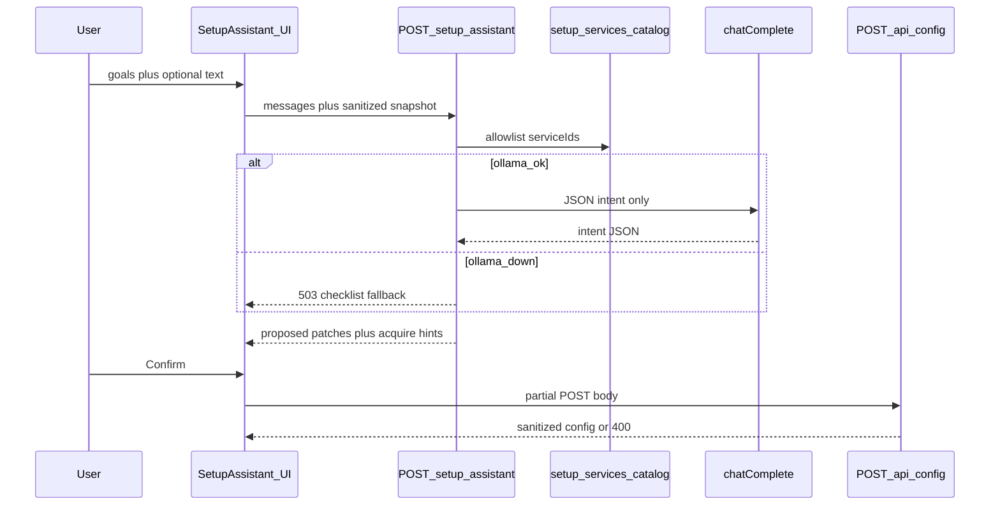

# SETUPUX — AI-guided setup for non-technical users

**Status:** Shipped (v1) — `POST /api/setup-assistant`, catalog in `lib/setup-services.js`, UI in `SetupAssistantPanel.jsx`. Plan-reviewer iteration 4 (READY). Canonical plan: `.cursor/plans/setupux_guided_onboarding_69702d83.plan.md` (user home) or workspace copy.

**Goal:** First-run and “lost in Settings” help via short conversational flow, optional LLM classification, **server-owned** provider instructions, and **validated** config writes.

---

## 1. Problem statement

- Many integrations (Ollama, Docling, memory, agent terminal/browser, dictation, experiment, auto-model map, etc.) surface in [src/components/SettingsPanel.jsx](src/components/SettingsPanel.jsx).
- [src/components/OnboardingWizard.jsx](src/components/OnboardingWizard.jsx) is **static** (welcome, Ollama intro, modes) and does not branch on goals or persist integration choices beyond completion flag.

---

## 2. Goals and non-goals

**Goals**

- Plain-language choices mapped to **stable `serviceId`** values from a **maintainer catalog** (no free-form config keys from the LLM).
- **Acquire** paths: fixed steps and **literal** `https://` links in catalog (never LLM-generated URLs).
- **Apply:** use existing **`POST /api/config`** for all keys that route supports (§5a); use **MCP HTTP API** from [lib/mcp-api-routes.js](lib/mcp-api-routes.js) only if v2 extends assistant to add/remove clients — **v1 defers MCP CRUD** to Settings with a deep link.
- **Verify:** reuse Ollama connection check, existing MCP connect UX, Docling hints from docs — no new daemons.

**Non-goals (v1)**

- No natural-language arbitrary config.
- No agent tools (`write_file`, terminal) inside setup assistant.
- No replacement of Settings; assistant is an **on-ramp** and re-runnable from Settings.

---

## 3. Architecture

**Principles**

1. Catalog is the only registry of `serviceId`, copy, links, and which `POST /api/config` keys each service may set.
2. LLM output is **strict JSON** (`{ "intents": [{ "id", "action" }] }`) — reject unknown `id` or `action` not in `enable|disable|skip`.
3. Secrets: user enters in UI; POST uses same masked-key ignore rules as Settings ([routes/config.js](routes/config.js) `ollamaApiKey` / `dictateGroqApiKey`).

---

## 4. Service catalog

### 4a. Entry schema (each row in `lib/setup-services.js`)

- `id`, `title`, `description`
- `userQuestions`: suggested multiple-choice labels (UI may render chips)
- `actions`: map `enable` | `disable` | `skip` → `configPostBody` fragment (object) **only** using keys from §5a
- `secrets`: optional fields with `acquireUrl`, `acquireSteps` (markdown allowed), `docsAnchor` (path into [docs/ENVIRONMENT_VARIABLES.md](docs/ENVIRONMENT_VARIABLES.md) / [docs/CC-CONFIG.md](docs/CC-CONFIG.md))
- `dependsOn`: other `id`s that must be satisfied first (e.g. `chatFolder` within `projectFolder`)
- `visibility`: `all` | `electronOnly` | `webOnly` (see §4b)
- `verifyHint`: enum handled client-side after apply (`ollama`, `mcp`, `docling`, `none`)

### 4b. Web vs Electron (v1 visibility matrix)

- **`all`:** Ollama URL/key, `projectFolder`, `chatFolder`, `docling.*`, `memory.*`, `dictationGroq` (config key `dictateGroqApiKey`), `imageSupport.*`, timeouts, `autoContinue`, `chatRequireExplicitFileWrites`, `experimentMode`, `agentBrowser`, `agentValidate`, `agentPlanner`, `agentAppSkills` — all apply via `POST /api/config` where supported.
- **`electronOnly`:** Agent terminal (`agentTerminal`) full UX; Data Management / port / updates — assistant shows **“Open Settings (desktop)”** on web instead of pretending to configure.
- **`webOnly`:** (Rare) if any future setting is browser-only, mirror pattern.

### 4c. v1 catalog rows (minimum shippable)

- `ollama_basics` — `ollamaUrl`, optional `ollamaApiKey` for cloud; acquire: `https://ollama.com`
- `project_context` — `projectFolder`, optional `chatFolder`; link PROJECT + FILE browser docs
- `docling_toggle` — `docling.enabled` / url doc; acquire: internal `docs/DOCLING-AUTO-START.md` or equivalent
- `dictation_groq` — `dictateGroqApiKey`; acquire: Groq console URL (literal in catalog)
- `memory_toggle` — `memory.enabled`, embedding fields per Settings
- `agent_safety_bundle` — optional single step: `agentTerminal.enabled` (false default), `agentBrowser.enabled`, `chatRequireExplicitFileWrites` explanation — **Electron** terminal sub-step only on `electronOnly`
- **`mcp_clients`:** v1 **skip** — UI button “MCP Clients (Settings)” only

---

## 5. Config and API surface

### 5a. Keys `POST /api/config` accepts (from [routes/config.js](routes/config.js) — exhaustive for mapper)

Body branches observed: `brandAssets`, `ollamaApiKey`, `dictateGroqApiKey`, `selectedModel`, `reviewTimeoutSec`, `chatTimeoutSec`, `numCtx`, `autoAdjustContext`, `preferredPort`, `imageSupport`, `docling`, `memory`, `agentTerminal`, `autoContinue`, `chatRequireExplicitFileWrites`, `agentBrowser`, `agentValidate`, `agentPlanner`, `agentAppSkills`, `experimentMode`, `autoModelMap`, plus top-level destructuring: `ollamaUrl`, `projectFolder`, `chatFolder`, `icmTemplatePath`. **Mapper must not emit any other key.**

**Semantics:** `ollamaUrl` is applied only when **truthy** (`if (ollamaUrl)` in the route). Empty string does **not** clear the stored URL; do not promise “reset Ollama URL” via empty POST without a server change. **`projectFolder` / `chatFolder`** differ: they use `!== undefined` checks; **falsy** values reset to home / project defaults (see route), so “clear folder” behavior is not the same as Ollama URL.

**Note:** `icmTemplatePath` and `brandAssets` are v2+ for assistant unless product explicitly wants them in v1.

### 5b. `POST /api/setup-assistant` contract

- **Auth:** **`requireLocalOrApiKey`** on the route (stricter than `tutorial-suggestions`).
- **Request:** `{ "messages": [ { "role":"user","content":"..." } ], "phase": "goals", "isElectron": false }` — keep small; cap total characters server-side.
- **Response (200):** `{ "intents": [...], "summaryMarkdown": "...", "acquire": [ { "id", "title", "stepsMd", "urls": [] } ], "configPatch": { } }` — intents and `configPatch` after catalog validation only.
- **Response (503):** `{ "code": "OLLAMA_UNAVAILABLE", "fallback": "checklist", "steps": [...] }` — no LLM path.
- **Rate limit:** mount path in [lib/rate-limiters-config.js](lib/rate-limiters-config.js); conservative default (12/min per IP).

### 5c. MCP and GitHub (v1)

- **MCP:** Document that **`mcpClients` is updated via MCP management routes** in [lib/mcp-api-routes.js](lib/mcp-api-routes.js), not `POST /api/config`. Assistant does not call those in v1.
- **GitHub:** **`POST /api/github/token`** exists in [routes/github.js](routes/github.js) with **`requireLocalOrApiKey`** (same family as `POST /api/config`). **v1** still = **link to GitHub tab** + PAT guidance (lowest risk). **v1.1 (optional):** assistant collects PAT in UI and POSTs to that route — only if product wants in-flow PAT without opening Settings.

---

## 6. UI integration

- **Onboarding:** First screen (“quick-start”) is the combined **Welcome — quick tour & settings** gate: overview of modes / Files / Settings / toolbar, then **Continue quick tour**, **Help me configure Settings now** (opens `SetupAssistantPanel`), or skip. Later entry: **Settings → General → Run setup assistant** (does not clear `th3rdai_onboarding_complete`).
- **Settings:** General tab — “Run setup assistant” reopening panel.
- **Confirm:** Disabled until required acknowledgments for high-risk toggles (terminal, allow-all `*` if ever surfaced — v1 keep terminal off by default in copy).

---

## 7. Security and privacy

- Snapshot = output of `sanitizeConfigForClient` only.
- Server logs: intent ids and success/failure, **never** secrets.
- JSON hardening: schema validate + reject unknown keys; size limits on `messages` and model output.

---

## 8. Testing

- Unit: intent → POST body mapper for each catalog row.
- Unit: JSON extraction edge cases (markdown fences, trailing text).
- Unit: Ollama-down → 503 branch.
- Integration: `POST /api/setup-assistant` returns **503** when Ollama URL is unreachable (child server + dead port).

---

## 9. Implementation phases

1. `lib/setup-services.js` + `lib/setup-assistant-json.js` + mapper unit tests.
2. `routes/setup-assistant.js` + `server.js` mount + rate limit + integration test.
3. `SetupAssistantPanel.jsx` + Onboarding + Settings entry.
4. This file + one-line pointer in [README.md](README.md).

---

## 10. Canonical doc links (embed in catalog, do not duplicate long prose)

- [docs/ENVIRONMENT_VARIABLES.md](docs/ENVIRONMENT_VARIABLES.md)
- [docs/CC-CONFIG.md](docs/CC-CONFIG.md)
- [docs/TROUBLESHOOTING.md](docs/TROUBLESHOOTING.md)

---

## 11. Resolved decisions (was “open questions”)

1. **MCP v1:** Settings tab only; no assistant MCP CRUD.
2. **Model routing:** Fixed model env `CC_SETUP_ASSISTANT_MODEL` with fallback to `mergeAutoModelMap(config.autoModelMap).chat`; no `auto` resolution in v1 to avoid surprise cloud calls.
3. **Locale:** English-only v1; structure catalog strings so i18n can wrap later.

---

## 12. Revision log

- **2026-05-08:** Iteration 2 — plan-reviewer pass integrated; READY verdict; MCP/GitHub/auth/Ollama-fallback corrections; §5a key enumeration from `routes/config.js`.
- **2026-05-08:** Iteration 3 — re-verify `POST /api/config` branches; **`ollamaUrl` truthy-only**; **`POST /api/github/token`** documented for optional v1.1; **`checkConnection`** name confirmed; App.jsx onboarding line refs 2483–2485.
- **2026-05-08:** Iteration 4 — **READY to implement**; folder vs `ollamaUrl` POST semantics; rate-limit + router patterns re-confirmed; supersede iteration-2 GitHub “grep first” archive note.
- **2026-05-08:** Added repo-root `SETUPUX.md`, Archon task alignment (§13), and shipped v1 API + UI wiring.

---

## 13. Archon task alignment (Code Companion — Vibe Coder Edition)

Project ID: `2da275aa-5c61-41a4-ac6d-b9aeebcbe843`

| Phase | Archon task ID                         | Title                                                                  |
| ----- | -------------------------------------- | ---------------------------------------------------------------------- |
| 1     | `75d0ef4b-80ac-46f7-b2b5-3233360d3211` | SETUPUX Phase 1 — setup-services catalog + mapper + unit tests         |
| 2     | `bb7f1486-6ec1-4404-972f-70cef4460fee` | SETUPUX Phase 2 — POST /api/setup-assistant + rate limit + integration |
| 3     | `65902c45-2b5c-4912-9a3d-c75ac846a579` | SETUPUX Phase 3 — SetupAssistantPanel + Onboarding + Settings entry    |
| 4     | `58f58f9f-088e-42b8-a7eb-d4a032b63078` | SETUPUX Phase 4 — docs pointer + Archon/SETUPUX sync                   |

Use Archon **feature** label `SETUPUX` to filter related tasks.
