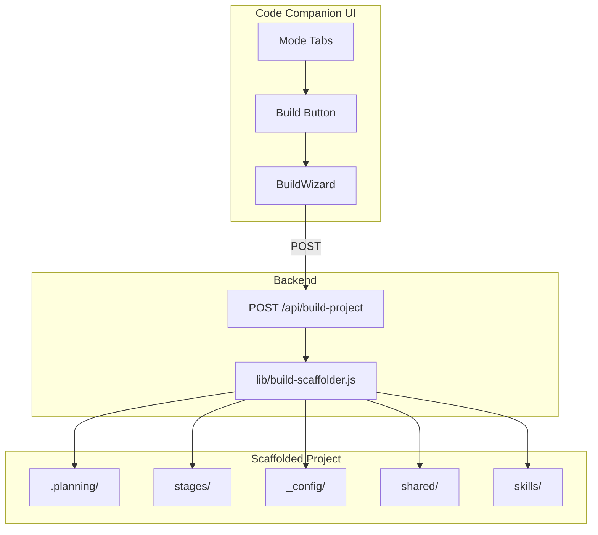

# Build Mode: GSD + ICM Integration — Draft Plan (for review)

**Status:** Draft for review (revised for gaps, edge cases, and implementation risks)  
**Purpose:** Add a **Build** mode that scaffolds a new project combining [get-shit-done](https://github.com/gsd-build/get-shit-done) (GSD) and the ICM Framework so users can build apps, tools, or other software using both methodologies.

---

## Goal

- Add a **Build** mode with a button next to **Create** in Code Companion.
- When selected, scaffold a new project that combines:
  - **GSD**: meta-prompting, research → plan → execute workflows, `.planning/` structure.
  - **ICM**: stage-based Research → Draft → Review, `stages/` structure.
- The scaffold should combine the **commands and skills** of both so the user can leverage them in Claude Code / Cursor to build what they want.

---

## Architecture



---

## Combined Project Structure (scaffolded output)

```
project-name/
├── .planning/           # GSD
│   ├── PROJECT.md
│   ├── ROADMAP.md
│   ├── STATE.md
│   ├── REQUIREMENTS.md
│   ├── config.json
│   └── phases/
├── stages/              # ICM
│   ├── 01-research/
│   │   ├── CONTEXT.md
│   │   ├── output/
│   │   └── references/
│   ├── 02-draft/
│   │   ├── CONTEXT.md
│   │   └── output/
│   └── 03-review/
│       ├── CONTEXT.md
│       └── output/
├── _config/
│   └── brand-voice.md
├── shared/
├── skills/              # Combined: GSD workflow refs + ICM skills
├── CLAUDE.md            # Identity + routing for both
├── CONTEXT.md           # Routing table (stages + planning)
└── README.md
```

---

## Phases

### Phase 1: Build Scaffolder

- **File:** `lib/build-scaffolder.js` (new).
- Reuse logic from `lib/icm-scaffolder.js`: `slugify`, `resolveOutputRoot`, `getWritableRoots`, `isUnderRoot`, `normalizeStages`.
- Create combined structure:
  - **GSD .planning/**: PROJECT.md, ROADMAP.md, STATE.md, REQUIREMENTS.md, config.json, `phases/.gitkeep`.
  - **ICM stages/**: Same as Create mode (01-research, 02-draft, 03-review) with CONTEXT.md per stage; `output/.gitkeep` and `references/.gitkeep` (research only).
  - **Root**: CLAUDE.md referencing both `.planning/` and `stages/`; CONTEXT.md with routing; README.md; `.editorconfig` (optional but recommended).
- Input options: `name`, `description`, `outputRoot`, `audience`, `tone`, `overwrite`. Trim `name` and `outputRoot`; treat empty `name` as invalid.
- **Scaffold strategy:** Write all files into a **temp directory** (e.g. `.build-scaffold-{slug}-{timestamp}`) under the same parent; on success, `renameSync` temp → project path. On any failure, **delete the temp dir** so no orphaned partial scaffolds. Write all files with **UTF-8 encoding** so content and paths are consistent across platforms.
- **Error codes** (return from scaffolder for API to map to HTTP): `MISSING_FIELDS`, `INVALID_OUTPUT_ROOT`, `PATH_OUTSIDE_ROOT`, `ALREADY_EXISTS`, `CLEANUP_FAILED` (overwrite delete failed), `TEMP_CREATE_FAILED`, `SCAFFOLD_FAILED`.
- **Path safety:** Resolve `outputRoot` (expand `~`), then require resolved path to be **under one of the writable roots** (same as Create). Reject path traversal and paths outside allowed roots.
- **Optional:** `.gitignore` in scaffold (e.g. `node_modules/`, `.env`, `dist/`) if project type is code-focused; otherwise leave to user. **Optional:** `gsdWorkflowsPath` config to copy or reference GSD workflows.
- **Dependencies:** Embed minimal GSD template content in build-scaffolder (recommended) so there is **no runtime dependency** on `~/.claude/get-shit-done/`; ICM structure from `lib/icm-scaffolder.js`.

### Phase 2: Build API and Server

- **server.js:**
  - Add `POST /api/build-project` with same **rate limit** as `POST /api/create-project` (per-IP, same window and max requests).
  - Do **not** use `requireTier('mode:build')` for now (Build is free). If gating later, add `requireTier('mode:build')` and ensure frontend shows upgrade message on 402/403.
  - Parse body: `name`, `description`, `outputRoot`, `audience`, `tone`, `overwrite`. Require `name` and `outputRoot`; return 400 with `code: 'MISSING_FIELDS'` if missing.
  - Call `scaffoldBuildProject(options, config)`; on success return 201 and `{ success, projectPath, projectFolder, files }`. On failure map scaffolder `code` to HTTP: `PATH_OUTSIDE_ROOT` → 403, `ALREADY_EXISTS` → 409, others → 400 or 500; always include `code` and `error` in JSON.
- **Config:** Build **reuses** Create’s allowed roots: use `config.createModeAllowedRoots` (via `getWritableRoots(config)` in build-scaffolder). When `createModeAllowedRoots` is missing or empty, **default** to `[os.homedir() + '/AI_Dev']` so scaffold works out of the box. **Do not add** a new config key (e.g. `buildModeAllowedRoots`) unless product explicitly requires different roots for Build. Document in README or config docs that **Create and Build** both respect `createModeAllowedRoots`; if the app has a Settings UI for “allowed project folders”, that same setting applies to Build (if roots are config-file only, document where to set `createModeAllowedRoots`, e.g. `.cc-config.json`).
- **Request body:** Ensure the Express app parses JSON bodies (e.g. `express.json()`) so `req.body` is available for `name`, `outputRoot`, etc.

### Phase 3: BuildWizard UI

- **File:** `src/components/BuildWizard.jsx` (new).
- Wizard similar to CreateWizard but simpler:
  - Step 1: Project name, description (“what you want to build”).
  - Step 2: Audience, tone (optional).
  - Step 3: Output location; overwrite checkbox.
  - Step 4: Review and Create.
- Reuse: slugify, validation, output root UI, success state (path + file list). Submit to `POST /api/build-project`. On success: show message, call `onSuccess(projectPath, data)` and `onToast(message)` so App can set project folder and open File Browser (same as Create).
- **Error handling:** On non-OK response, show `data.error` or `data.message`. For **user-friendly copy**, map `data.code`: e.g. `PATH_OUTSIDE_ROOT` → “That folder isn’t allowed. You can add it in Settings → allowed project folders.” (or “… in config …” if no Settings UI); `ALREADY_EXISTS` → “A project with this name already exists. Pick a different name or enable Overwrite.” On **network error** or non-JSON response (e.g. fetch throws or `res.json()` fails), show a generic message (e.g. “Network error”) and **do not clear the form** so the user can fix connectivity and retry.
- **Name handling:** Validate project name in step 1 (required). Either: (a) do not submit a fallback when name is empty (block “Next” / “Create” until name is non-empty), or (b) if product allows, send a default (e.g. `name.trim() || 'New Build'`) and document that backend accepts it. Prefer (a) for clearer UX and consistent backend validation.
- **Accessibility:** Use `role="form"`, `aria-label` on wizard and step buttons, `aria-current="step"` on current step, `aria-labelledby` / `id` on step headings, `role="alert"` on error messages. Keep step indicator and buttons keyboard-usable.

### Phase 4: App Integration

- **src/App.jsx:** Add Build to `MODES` **immediately after Create** (same order in the array) for discoverability: `id: 'build'`, label, icon (e.g. 🏗️), `tier: 'free'`, description, placeholder. Add `mode === 'build'` branch to render `BuildWizard` with `defaultOutputRoot={projectFolder || '~/AI_Dev/'}`, `onSuccess`, `onToast`. Implement `handleBuildSuccess(projectPath)`: set project folder (and persist via `POST /api/config` with `projectFolder`), open File Browser, close GitHub panel if desired — mirror `handleCreateSuccess`. **Hide chat input** when `mode === 'build'` (same condition as Create and Review). Optionally hide the stats bar when in Build (and Create) for consistency with Review; if left visible, no token count is used during the wizard.
- **src/constants/tiers.js:** Add `build: 'free'` to MODE_TIERS (or `'pro'` if Build is gated later).
- **lib/license-manager.js:** Add `'mode:build': 'free'` to FEATURE_TIERS so tier checks stay in sync; add `requireTier('mode:build')` on the route only if/when Build is gated.

### Phase 5: GSD Template and Skills Integration

- **Decision (recommended):** Embed minimal GSD template content (PROJECT.md, ROADMAP.md, STATE.md, REQUIREMENTS.md, config.json) **inside** build-scaffolder. No runtime dependency on `~/.claude/get-shit-done/` or `GSD_HOME`; works even when GSD is not installed. Alternative: read from install path at scaffold time (simpler to stay in sync with GSD but fails if GSD not present).
- **Skills/commands:** Add `skills/gsd-workflows.md` in the scaffold describing how to run GSD commands from the project root (e.g. `/gsd:plan-phase`, `/gsd:execute-phase`, `/gsd:progress`) and that the project was scaffolded by Build mode. Add `skills/README.md` pointing to `gsd-workflows.md`. ICM usage is already described in CLAUDE.md and CONTEXT.md; no separate ICM skill file required unless we add reusable ICM snippets later.

---

## Risks, Edge Cases, and Mitigations

| Risk / Edge Case | Mitigation |
|------------------|------------|
| User chooses output path outside allowed roots | Validate with `isUnderRoot(resolvedRoot, getWritableRoots(config))`; return 403 and `PATH_OUTSIDE_ROOT`; show friendly message in UI suggesting Settings. |
| Project folder already exists and user did not check Overwrite | Return 409 and `ALREADY_EXISTS`; UI message: suggest different name or enable Overwrite. |
| Overwrite checked but directory is locked or permission denied | Return 400 with `CLEANUP_FAILED`; show server error message. |
| Disk full or write failure mid-scaffold | Write into temp dir first; on exception, delete temp dir and return `SCAFFOLD_FAILED` so no partial project is left. |
| Concurrent requests for same project path | Temp dir includes timestamp; one request wins rename. The other gets rename error → cleanup temp; document that duplicate concurrent creates may leave one orphan temp dir (rare). |
| Empty or whitespace-only project name | Treat as invalid; require non-empty after trim; backend returns `MISSING_FIELDS` if missing. |
| Path traversal in `outputRoot` (e.g. `../../../etc`) | Resolve to absolute and check `isUnderRoot`; only paths under allowed roots accepted. |
| Very long project name | Slugify with same max length as ICM (e.g. 64 chars); no new risk. |
| GSD not installed on user machine | Scaffold is self-contained; skills/gsd-workflows.md explains that GSD must be installed to run commands. No runtime dependency in Code Companion. |
| Windows reserved folder names (e.g. con, prn, aux) | slugify yields lowercase; if project name becomes one of these, mkdir/rename can fail on Windows. Optional: add a reserved-name check and suffix (e.g. `con` → `con-project`) or document as rare edge case. |
| Non-JSON or missing API response | Frontend: catch parse errors and network errors; show generic message and keep form state so user can retry. |

---

## Implementation Pitfalls (avoid these)

- **Do not** add a separate config key for Build allowed roots unless product requires it; reusing `createModeAllowedRoots` keeps behavior consistent and avoids config drift.
- **Do not** read GSD templates from disk at request time if you want zero dependency on GSD install; embed minimal content in build-scaffolder.
- **Do not** forget to hide the chat input when `mode === 'build'` (same as Create), or users will see an input that does nothing.
- **Do not** return 200 for scaffold failure; use 201 for success and 400/403/409/500 with a `code` so the client can show specific messages.
- **Do not** skip temp-dir strategy: writing directly into the final path can leave a half-created project on failure; temp dir + rename keeps atomicity.
- **Do not** forget rate limiting on `POST /api/build-project`; same as create-project to prevent abuse.
- **Do not** clear wizard form on network or server error; keep form state so the user can retry without re-entering everything.
- **Do not** assume Settings UI exists for allowed roots; document config key `createModeAllowedRoots` (and default `~/AI_Dev`) so deployers know how to restrict or extend paths.

---

## Implementation Order

Implement in phase order: **1 → 2 → 3 → 4 → 5**. Phase 2 depends on Phase 1 (scaffolder); Phase 3 depends on Phase 2 (API); Phase 4 depends on Phase 3 (BuildWizard); Phase 5 is covered by Phase 1 content (embedded GSD + skills in scaffold). Unit tests for the scaffolder can be added alongside Phase 1; E2E for the full flow after Phase 4.

---

## Files to Create/Modify

| File | Action |
|------|--------|
| lib/build-scaffolder.js | Create |
| server.js | Add POST /api/build-project |
| src/components/BuildWizard.jsx | Create |
| src/App.jsx | Add Build mode, BuildWizard branch |
| src/constants/tiers.js | Add build to MODE_TIERS |
| lib/license-manager.js | Add mode:build to FEATURE_TIERS (if gated) |

---

## Out of Scope (future)

- Running GSD commands from within Code Companion (would require MCP or subprocess to gsd-tools).
- ICM_FW shell scripts (e.g. 01-create-project.sh) — scaffold produces structure; scripts are optional.
- License gating for Build (assume free for now; can add later).
- Adding a default `.gitignore` to the scaffold (user can add manually; optional enhancement).
- Supporting custom GSD workflow files or custom stage names in the wizard (fixed GSD + ICM structure for v1).

---

## Verification (acceptance)

- [ ] Build mode appears in mode tabs next to Create.
- [ ] BuildWizard completes and scaffolds project; success shows path and file list; File Browser opens to new folder when configured.
- [ ] Scaffolded project has both `.planning/` (with PROJECT.md, ROADMAP.md, STATE.md, REQUIREMENTS.md, config.json, phases/) and `stages/` (01-research, 02-draft, 03-review with CONTEXT.md and output/).
- [ ] CLAUDE.md and CONTEXT.md route to both GSD and ICM; skills/gsd-workflows.md exists and describes GSD commands.
- [ ] User can open project in Cursor/Claude Code and use GSD and ICM commands/skills (no runtime dependency on GSD inside Code Companion).
- [ ] Path outside allowed root: API returns 403 with `PATH_OUTSIDE_ROOT`; UI shows clear message (e.g. add folder in Settings).
- [ ] Project already exists without Overwrite: API returns 409 with `ALREADY_EXISTS`; UI suggests different name or Overwrite.
- [ ] Chat input is hidden when Build mode is selected (same as Create).
- [ ] E2E test: Add or extend E2E (e.g. in `tests/e2e/` or project’s E2E path) so Build wizard flow creates a valid project structure; optionally verify 403 for path outside root and 409 for already-exists without overwrite.

---

## Review notes

- Confirm phase order and scope.
- Confirm GSD template strategy: **embedded** (recommended) vs. read from install path.
- Confirm Build is **free** for now; gating can be added later via `requireTier('mode:build')` and FEATURE_TIERS.
- Confirm **single config key** `createModeAllowedRoots` for both Create and Build (no separate build roots unless required).
- Optional: add `.gitignore` to scaffold (e.g. `node_modules/`, `.env`) for code projects; currently out of scope.
- Suggest edits in comments or via PR against this draft.
