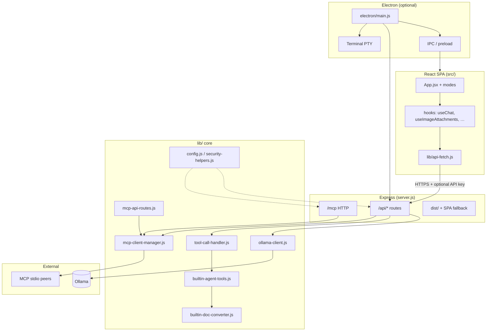

# Code Companion — Architecture (GitNexus map)

This document is generated from the **GitNexus** knowledge graph for repo **CodeCompanion**. For a longer narrative (entry points, config, abort/export behavior), see [`.planning/codebase/ARCHITECTURE.md`](.planning/codebase/ARCHITECTURE.md).

**Index note:** At generation time, GitNexus reported the index **one commit behind HEAD** — run `npx gitnexus analyze` in the repo root if you need symbols and processes in sync with your latest changes.

---

## Overview (graph stats)

| Metric                            |  Value |
| --------------------------------- | -----: |
| Files                             |    416 |
| Symbols (nodes)                   |  8,016 |
| Edges                             | 10,982 |
| Functional communities (clusters) |    188 |
| Named execution flows (processes) |    214 |

**Stack (concise):** Node.js **Express** API + static **Vite/React** SPA; optional **Electron** shell (IPC, packaged data dir, integrated terminal); local **Ollama** over HTTP; **MCP** (built-in HTTP + stdio server, external clients). Persistence is **JSON files** (config, history, memory, experiments, build registry) — no separate database.

---

## Functional areas (top clusters)

GitNexus groups symbols into **modules** (cohesive subgraphs). Below are the **largest** modules by symbol count (20 of **36** total shown in the graph export).

| Module       | Symbols | Cohesion |
| ------------ | ------: | -------- |
| Components   |     300 | 80%      |
| Routes       |      59 | 82%      |
| Hooks        |      35 | 66%      |
| Electron     |      33 | 97%      |
| Unit (tests) |      24 | 92%      |
| 3d           |      21 | 85%      |
| Scripts      |      20 | 80%      |
| Mcp          |      13 | 70%      |
| Ui           |      12 | 73%      |

Smaller numbered clusters (`Cluster_*`) cover cross-cutting utilities, builders, and feature-specific subgraphs. **Routes** + **`lib/`** (not always labeled as a single cluster in the export) implement `/api/*`, `/mcp`, document conversion, review, security, validate, and build APIs mounted from `server.js`.

---

## Key execution flows (five traces)

These are **step-by-step call traces** from GitNexus (`gitnexus://repo/CodeCompanion/process/{name}`). They illustrate how major subsystems chain together.

### 1. `App → ApiFetch` (client → API boundary)

Cross-community · 6 steps

1. `App` — `src/App.jsx`
2. `useChat` — `src/hooks/useChat.js`
3. `handleSend` — `src/hooks/useChat.js`
4. `saveConversation` — `src/hooks/useChat.js`
5. `fetchHistory` — `src/hooks/useChat.js`
6. `apiFetch` — `src/lib/api-fetch.js`

**Takeaway:** Conversation send/save/history paths converge on **`apiFetch`**, which applies **`X-CC-API-Key`** when configured so non-loopback access stays gated consistently with `lib/security-helpers.js`.

### 2. `CreateMcpApiRoutes → Close` (MCP client wiring ↔ UI lifecycle)

Cross-community · 5 steps

1. `createMcpApiRoutes` — `lib/mcp-api-routes.js`
2. `connect` — `lib/mcp-client-manager.js`
3. `_doConnect` — `lib/mcp-client-manager.js`
4. `disconnect` — `lib/mcp-client-manager.js`
5. `close` — `src/App.jsx`

**Takeaway:** MCP client transports are managed in **`lib/mcp-client-manager.js`**; API routes expose MCP operations to the SPA, and teardown ties back to **`App`** lifecycle.

### 3. `Main → JsonHeaders` (stdio MCP server → Ollama)

Cross-community · 5 steps

1. `main` — `mcp-server.js`
2. `registerAllTools` — `mcp/tools.js`
3. `createModeHandler` — `mcp/tools.js`
4. `chatComplete` — `lib/ollama-client.js`
5. `jsonHeaders` — `lib/ollama-client.js`

**Takeaway:** The **stdio** MCP entry (`mcp-server.js`) registers tools that delegate into **`lib/ollama-client.js`** for completions, sharing header/auth helpers with the web server path.

### 4. `ExecuteTool → ConvertPdf` (agent tool → built-in document conversion)

Cross-community · 5 steps

1. `executeTool` — `lib/tool-call-handler.js`
2. `executeBuiltinTool` — `lib/builtin-agent-tools.js`
3. `generateOfficeFileTool` — `lib/builtin-agent-tools.js`
4. `convertBuiltin` — `lib/builtin-doc-converter.js`
5. `convertPdf` — `lib/builtin-doc-converter.js`

**Takeaway:** Model-emitted tool calls flow through **`tool-call-handler`** into **builtins**, then **built-in conversion** (PDF and other formats) before office/export paths where applicable.

### 5. `HandlePasteImage → ExtractBase64` (paste/drag images in the SPA)

Intra-community · 5 steps

1. `handlePasteImage` — `src/hooks/useImageAttachments.js`
2. `queueImageProcessing` — `src/hooks/useImageAttachments.js`
3. `processNextInQueue` — `src/hooks/useImageAttachments.js`
4. `processImage` — `src/lib/image-processor.js`
5. `extractBase64` — `src/lib/image-processor.js`

**Takeaway:** Image attachments are queued and normalized in the **renderer** before chat payloads include vision-safe representations.

---

## Mermaid — major areas and connections

---

## Using GitNexus from here

| Resource                                       | Purpose                               |
| ---------------------------------------------- | ------------------------------------- |
| `gitnexus://repo/CodeCompanion/context`        | Stats, staleness, tool/resource index |
| `gitnexus://repo/CodeCompanion/clusters`       | All functional modules                |
| `gitnexus://repo/CodeCompanion/processes`      | Catalog of execution flows            |
| `gitnexus://repo/CodeCompanion/process/{name}` | YAML step trace for one flow          |

Process names use Unicode arrows (`→`) in graph exports; percent-encode spaces and `→` when fetching by URI.

**Tools:** `query` (concept → ranked processes), `context` (symbol 360°), `impact` / `detect_changes` (edit safety), `rename` (graph-aware rename).
