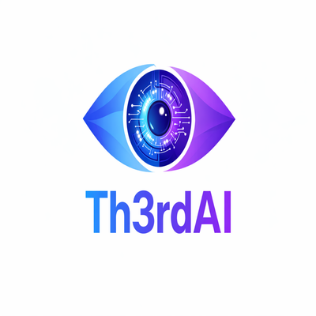

<p align="center">
  
</p>

# Contributing to Code Companion

Thanks for your interest in contributing! Code Companion is an open-source project by [Th3rdAI](https://github.com/Th3rdai).

## Getting Started

1. Fork the repository
2. Clone your fork locally
3. Install dependencies: `npm install`
4. Start the dev servers: `npm run dev`
5. Make sure [Ollama](https://ollama.com) is running locally

## Development

- **Backend:** `node server.js` (Express on port 8900)
- **Frontend:** `npx vite` (React + Tailwind on port 8902)
- **Both:** `npm run dev` (Vite + Express together)
- **Production-style run:** `./deploy.sh` or `npm run build && ./startup.sh`

## Desktop (Electron)

**Shipping installers** (what users download and what drives in-app updates) is done by **[GitHub Actions](.github/workflows/build.yml)** when you push a **`v*`** tag that matches **`package.json`** — see **[docs/RELEASES-AND-UPDATES.md](docs/RELEASES-AND-UPDATES.md)**. Do **not** use local `electron:publish:*` for routine releases unless CI is broken (emergency path in that doc).

Local **electron-builder** (`npm run electron:build`, per-platform scripts) is for **development and packaging smoke tests** only. **Release signing:** **`electron:*:release`** scripts set distribution flags — **macOS** (`MAC_CODESIGN_IDENTITY`), **Windows** (`WIN_CSC_LINK` / `CSC_LINK` or `CSC_NAME`), **Linux** optional GPG (`LINUX_GPG_KEY_ID` with `LINUX_GPG_SIGN`) — see **[BUILD.md](BUILD.md)** and **[docs/ENVIRONMENT_VARIABLES.md](docs/ENVIRONMENT_VARIABLES.md)**.

## Testing

Before submitting a PR, run the full test suite:

```bash
npm test                  # All tests (unit + Playwright UI + E2E)
npm run test:unit         # Unit tests only (node:test)
npm run test:ui           # Playwright UI component tests
npm run test:e2e          # Playwright E2E workflow tests
```

Details: **[docs/TESTING.md](docs/TESTING.md)** (folders, `BASE_URL`, CI).

**Playwright:** The config starts a **built** app with `FORCE_HTTP=1` on port **4173** (HTTP). Default `BASE_URL` is **`http://127.0.0.1:4173`** to match that. If you point tests at an HTTPS server, set `BASE_URL` accordingly (see `docs/TESTING.md`).

**Validation Command:** Use `/validate-project` slash command in Claude Code to run the comprehensive 7-phase validation suite (build, tests, API smoke tests, workflow tests).

## Security

Please read **[SECURITY.md](SECURITY.md)** before reporting vulnerabilities. For environment and deployment knobs that affect exposure (`HOST`, TLS, rate limits), see **[docs/ENVIRONMENT_VARIABLES.md](docs/ENVIRONMENT_VARIABLES.md)**.

## Pull Requests

- Create a feature branch from `master`
- Keep changes focused — one feature or fix per PR
- Test your changes locally before submitting (run `npm test`)
- Write a clear PR description explaining what and why

## Code Style

- React functional components with hooks
- **Component files:** use **PascalCase** names (e.g. `ReviewPanel.jsx`, `DictateButton.jsx`). Group related components in subfolders (`builders/`, `3d/`, etc.).
- Tailwind CSS for styling (no separate CSS files)
- Express routes in `server.js`, business logic in `lib/`
- Friendly-teacher tone in all user-facing text — analogies, no jargon

## Reporting Bugs

Open an issue with:

- What you expected to happen
- What actually happened
- Steps to reproduce
- Your OS and Node.js version

## License

By contributing, you agree that your contributions may be used by Th3rdAI under the same [LICENSE](LICENSE) terms (including the contribution grant in section 4), unless you and Th3rdAI sign a different contributor agreement.
