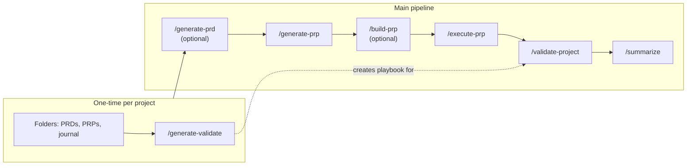

# Build workflow — diagram & MCP (Stitch + Nano Banana)

This file gives you a **Mermaid diagram** you can render in **Code Companion → Diagram** mode (paste the fenced block into chat), plus **optional** steps to produce **images** or **UI mockups** using the **Stitch** and **Nano Banana** MCP servers configured in Code Companion (**Settings → MCP Clients**).

---

## Mermaid diagram (canonical)

Paste this into Diagram mode or any Markdown viewer that supports Mermaid:

**Reading the chart**

- **`/generate-validate`** runs once (or after big tooling changes). It **authors** the repo-specific **`/validate-project`** playbook; the dashed line means that playbook is what **`/validate-project`** executes later.
- **`/generate-prd`** is optional if you already know what to build.
- **`/build-prp`** is optional if you’re happy to go straight from PRP → **`/execute-prp`**.

---

## Nano Banana MCP — generate a flowchart-style image

**Nano Banana** (`nanobanana-mcp-server`) uses **Gemini** image models. It needs **`GEMINI_API_KEY`** or **`GOOGLE_API_KEY`** in your environment (e.g. Code Companion Data `.env` on macOS: `~/Library/Application Support/code-companion/.env` — see `docs/ENVIRONMENT_VARIABLES.md`).

1. Enable the **Nano Banana** MCP client in Code Companion and ensure the server starts (check logs for auth errors).
2. In chat, ask the model to use the **Nano Banana** image tool with a prompt like:

> **Prompt (copy-paste):**  
> Create a clean **landscape infographic** of a software **Build workflow**: optional “PRD” box → “generate-prp” → optional “build-prp (review)” → “execute-prp” → “validate-project” → “summarize”. Show a **separate lane** for one-time “generate-validate” feeding into “validate-project”. Use **rounded rectangles**, **left-to-right flow**, **developer-tooling** aesthetic (dark background, teal and amber accents), **no tiny text**, labels: `/generate-prd`, `/generate-prp`, `/build-prp`, `/execute-prp`, `/validate-project`, `/summarize`, `/generate-validate`.

3. Save the returned image into your project (e.g. `docs/images/build-workflow.png`) and link it from `BUILD-WORKFLOW-GUIDE.md` if you want a bitmap alongside Mermaid.

**Note:** Automated calls from this repo failed here with **“No valid authentication configuration”** until a Gemini API key is set.

---

## Stitch MCP — UI companion (not a native flowchart engine)

**Stitch** (`npx @_davideast/stitch-mcp proxy`) connects to **Google Stitch** design projects. It is aimed at **screens and HTML/CSS**, not at graphviz-style flowcharts. Typical uses:

1. **`npx @_davideast/stitch-mcp init`** — configure auth (`STITCH_API_KEY` / Google Cloud as per Stitch docs).
2. In **Stitch**, create a **single screen** that **visually mirrors** the workflow (cards or steps for each slash command).
3. Use MCP tools such as **`get_screen_image`** or **`build_site`** to pull **screenshots or HTML** into your repo for documentation.

**Note:** CLI `tool` calls failed here with **“Authentication failed”** until API credentials and project IDs are configured.

---

## Suggested layout

| Asset                       | Tool            | Best for                                      |
| --------------------------- | --------------- | --------------------------------------------- |
| **Mermaid** (above)         | Diagram mode    | Version-controlled, editable, always in-repo  |
| **PNG / illustration**      | **Nano Banana** | Slides, README hero image, shareable PNG      |
| **UI mock / Stitch screen** | **Stitch**      | Product-style “Build pipeline” dashboard mock |

---

## Related

- Step-by-step narrative: **`BUILD-WORKFLOW-GUIDE.md`**
- Install commands into a project: **`README.md`**, **`ADD-TO-PROJECT.md`**
