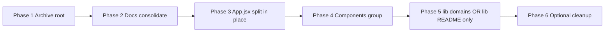

# REORGPLAN — Code Companion file reorganization

**Status:** **Phase 1 complete** (2026-06-04) — Phase 2–6 ready; Phase 1 merged locally (awaiting commit/PR)  
**Created:** 2026-06-04  
**Goal:** Reduce root clutter, group related files into predictable folders, and park obsolete artifacts in `!ARCHIVES/` for later deletion — **without changing runtime behavior, packaging, or capabilities.**

---

## Verdict (plan-reviewer iteration 3)

**READY to implement Phase 1–2 immediately.** Phases 3–6 are specified with no blockers; execute **one phase per PR** with the verification matrix below.

**Iteration 3 changes:** Phase 1B scoped to **git-tracked** assets only (root `*.png` are `.gitignore`d); removed gitignored artifacts from 1A; Phase 2 grep checklist expanded; Phase 4 file map + `ExperimentPanel`/`SecurityPanel` placement clarified; Phase 5 `lib/mcp/` renamed to `lib/mcp-client/` (avoids collision with top-level `mcp/`); Phase 6 adds root dev scripts.

| Phase | Name                         | Risk   | Ship alone?                                |
| ----- | ---------------------------- | ------ | ------------------------------------------ |
| 1     | Archive root clutter         | LOW    | Yes — **recommended first PR**             |
| 2     | Docs consolidate             | LOW    | Yes                                        |
| 3     | `App.jsx` split **in place** | HIGH   | Yes — before any component path move       |
| 4     | `src/components/` grouping   | MEDIUM | One subfolder group per commit             |
| 5     | `lib/` domains or README     | MEDIUM | One subfolder at a time **or** README only |
| 6     | Optional cleanup             | LOW    | Yes                                        |

**Execution order:** 1 → 2 → 3 → 4 → 5 → 6 (phase numbers now match this order).

---

## Codebase ground truth (Phase 0)

- **Runtime entry points (fixed paths):** `server.js`, `mcp-server.js`, `electron/main.js`, `src/main.jsx` → `src/App.jsx`, `index.html` (Vite root).
- **Electron packaging** (`electron-builder.config.js` `files`): ships `dist/`, `lib/`, `mcp/`, `routes/`, `server.js`, `mcp-server.js`, shell scripts, `electron/`, `resources/`, `package.json`, `node_modules` — **excludes** `src/`, `tests/`, `scripts/`, `docs/`, `design-system/`, `.planning/`, `landing/`, `MAKER_framework/`.
- **Routes split already done:** 20 routers under `routes/`; `server.js` ~918 lines (bootstrap + wiring). **Do not add a parallel “extract routes” phase** — only thin remaining inline handlers if 24.5 scope requires it.
- **Frontend:** `src/App.jsx` ~2,760 lines; **86** component files under `src/components/` (**49** flat at top level; subfolders: `builders/`, `dashboard/`, `3d/`, `ui/`). **`SettingsPanel.jsx`** ~3,549 lines — out of scope for this reorg (future 24.5+ slice). **`DashboardView`** is live; **`DashboardPanel.jsx`** is orphaned (not imported in `App.jsx`).
- **Hooks (existing):** `src/hooks/useChat.js`, `useModels.js`, `useAbortable.js`, `useAbortRegistry.js`, `useImageAttachments.js` — Phase 3 extends this set; do not re-extract chat/model state.
- **`lib/`:** 63 flat modules — no subfolders today; every move requires updating `require()` paths across `server.js`, `routes/`, tests, and MCP. **`lib/context-budget.js`** and **`src/lib/context-budget.js`** are separate modules — do not conflate during grouping.
- **`!ARCHIVES/`** exists (`!ARCHIVES/pre-vite-public/`); `.gitignore` tracks `!ARCHIVES/`. **Tooling gap:** `eslint.config.mjs` ignores `**/ARCHIVES/**` and `.prettierignore` has `ARCHIVES` — neither matches the literal folder name `!ARCHIVES/`. Fix in Phase 1 (see §1E).
- **`tests/test/`** duplicate tree — **already removed** (see `.planning/phases/19-tech-health/24.5-01-SUMMARY.md`). Do not reintroduce.
- **Gitignored runtime data (do not archive into git):** `logs/`, `memory/`, `experiments/`, `github-repos/`, `release-staging/`, `dist/`, `release/`, `node_modules/`.
- **GitNexus impact (path sensitivity):** moving `src/App.jsx` breaks `src/main.jsx` import (d=1). `server.js` is the server entry — path changes break `package.json` `"start"`, Electron fork, CI smoke tests, and Docker.

---

## Principles

1. **Behavior-neutral** — renames/moves only; no feature edits mixed into reorg commits.
2. **One phase per PR** — atomic commits; run `npm run validate:fast` before merge.
3. **Archive, don’t delete** — uncertain files → `!ARCHIVES/<category>/` with a manifest (`!ARCHIVES/README.md`).
4. **Packaging invariant** — anything in `electron-builder.config.js` `files` stays at the **same relative path** unless the config is updated in the same commit.
5. **Import shim window** — if `lib/` or `src/components/` moves are unavoidable, keep a re-export stub at the old path for one release cycle (optional; prefer single atomic update + full test run).
6. **App before paths** — extract `App.jsx` shell/hooks **in place** (Phase 3) before moving component files (Phase 4) so import churn happens once on a smaller surface.

---

## Do-not-move (runtime & packaging)

| Path                                                                                                           | Reason                                                                                                                                                                                         |
| -------------------------------------------------------------------------------------------------------------- | ---------------------------------------------------------------------------------------------------------------------------------------------------------------------------------------------- |
| `server.js`, `mcp-server.js`                                                                                   | Express/MCP entry; Electron forks `server.js`                                                                                                                                                  |
| `index.html`                                                                                                   | Vite entry                                                                                                                                                                                     |
| `package.json`, `package-lock.json`                                                                            | npm/Electron metadata                                                                                                                                                                          |
| `electron-builder.config.js`, `vite.config.js`, `playwright*.config.js`, `eslint.config.mjs`                   | Tooling                                                                                                                                                                                        |
| `deploy.sh`, `rebuild.sh`, `startup.sh`                                                                        | Packaged in installers                                                                                                                                                                         |
| `dist/`                                                                                                        | Production frontend (build output)                                                                                                                                                             |
| `lib/`, `mcp/`, `routes/`                                                                                      | Packaged backend (path may change only with config + import sweep)                                                                                                                             |
| `electron/`                                                                                                    | Desktop main process                                                                                                                                                                           |
| `resources/`, `cert/`                                                                                          | Icons, DMG, TLS template                                                                                                                                                                       |
| `patches/`                                                                                                     | `patch-package` on install                                                                                                                                                                     |
| `IDE_COMMANDS/`                                                                                                | Copied into scaffolded projects (Create/Build)                                                                                                                                                 |
| `tests/`                                                                                                       | CI; update imports if code moves                                                                                                                                                               |
| `scripts/smoke-test-server.js`, `scripts/validate-p7-workflows.sh`                                             | Release validation                                                                                                                                                                             |
| `README.md`, `CHANGELOG.md`, `CLAUDE.md`, `AGENTS.md`, `BUILD.md`, `LICENSE`, `SECURITY.md`, `CONTRIBUTING.md` | Canonical root docs                                                                                                                                                                            |
| `.cc-config.json.example`, `.env.example`                                                                      | Committed config templates                                                                                                                                                                     |
| `gitnexus-web/`                                                                                                | Typecheck project (`npm run typecheck`)                                                                                                                                                        |
| **`validate.md`**                                                                                              | **Active repo validation command** (lint/typecheck/test/E2E phases for this project). **Keep at root** — not a Validate-mode output template and not superseded by `IDE_COMMANDS/validate.md`. |

---

## Phase 1 — Archive root clutter (LOW risk)

**Objective:** Move completed plans, review passes, and unreferenced screenshots out of repo root. **No code imports change** (except README link for `fix_cache.html`).

### 1A → `!ARCHIVES/root-plans/`

Historical planning / fix docs (superseded by shipped code or `.planning/`):

| File                                                                                                         | Notes                                             |
| ------------------------------------------------------------------------------------------------------------ | ------------------------------------------------- |
| `DASHBOARD.md`                                                                                               | 1400+ line implementation plan; dashboard shipped |
| `DASHBOARD-REVIEW.md`, `DASHBOARD-REVIEW-PASS2.md`, `DASHBOARD-REVIEW-PASS3.md`, `DASHBOARD-REVIEW-PASS4.md` | Plan review iterations                            |
| `DASHBOARD-UIPRO-REVIEW.md`, `DASHBOARD-UIPRO-FIXES-APPLIED.md`                                              | UI review artifacts                               |
| `FILEFIX.md`, `MCPFIX.md`, `MCPFIXPLAN.md`, `RESPONSEFIX.md`, `TERMINALFIX.md`, `TABLEFIX.md`                | Completed fix plans                               |
| `FIXLIST.md`, `IMPROVEPLAN2.md`, `FEATURESv2.md`                                                             | Backlog snapshots                                 |
| `SIP.md`, `SIP_WIP.md`                                                                                       | Stale SIP drafts                                  |
| `PHASE-28-ANALYSIS-ROUND-2.md`, `PHASE-28-GAP-ANALYSIS.md`                                                   | Phase analysis                                    |
| `MULTIFILE-REVIEW.md`, `MULTIFILE-ARCHIVED.md`                                                               | Multi-file review                                 |
| `PCI-ASSISTANT-ISSUE-SUMMARY.md`                                                                             | Unrelated project note                            |
| `SECURITY-FIXES-VALIDATION-REPORT.md`                                                                        | Point-in-time report                              |
| `v1.6.5-analysis.md`                                                                                         | Old release analysis                              |
| `VOICE-DICTATION-PLAN.md`                                                                                    | Superseded by `docs/VOICE-DICTATION-*`            |
| `OWASP-pentest-agent.md`                                                                                     | Agent prompt artifact                             |
| `AGENTSKILL.md`                                                                                              | Duplicate of skill patterns elsewhere             |
| `CLAUDE_md.bak`                                                                                              | Backup                                            |

**Not in git (`.gitignore`) — do not `git mv`:** `e2e-test-report.md`, `full-snapshot.md` (local Playwright artifacts). Delete locally if present; already ignored.

**Keep at root (still referenced or active):**

| File                  | Referenced by                                                   |
| --------------------- | --------------------------------------------------------------- |
| `DASHBOARD-STATUS.md` | Active status doc (move in Phase 2)                             |
| `CLIPLAN.md`          | `CLAUDE.md`, `BUILD.md`, `docs/AGENT-READINESS.md`, tests       |
| `CLOUDAPI.md`         | `docs/PROVIDERS.md`, `CHANGELOG.md`                             |
| `ARCHITECTURE.md`     | GitNexus index pointer                                          |
| `whats-next.md`       | `CLAUDE.md`, `.planning/STATE.md`                               |
| `validate.md`         | Repo validation command — **keep at root**                      |
| `REORGPLAN.md`        | This plan — move to `docs/REORGPLAN.md` after Phase 1 completes |

### 1B → `!ARCHIVES/root-assets/` (local cleanup only)

Root `*.png` files are **gitignored** (`.gitignore:76` — only `resources/*.png` is tracked). They do not affect remote/CI clutter. If present locally, delete or move to `!ARCHIVES/root-assets/` **outside git** (optional housekeeping):

- `agent-terminal-settings.png`, `agent-terminal-test-result.png`, `hue-slider-settings.png`
- `test-agent-terminal-section.png`, `test-main-ui.png`, `test-settings-agent-terminal.png`, `test-settings-panel.png`, `test-terminal-header.png`

**No Phase 1 PR action required** unless you force-add PNGs (don't).

### 1C → `!ARCHIVES/landing/`

- `landing/index.html` — not in Electron `files`; standalone marketing stub (excluded from package already).

### 1D → `!ARCHIVES/root-html/`

- `fix_cache.html` — troubleshooting helper; README mentions it — **move + update README link** to `!ARCHIVES/root-html/fix_cache.html` in same commit.

### 1E — Tooling: ignore `!ARCHIVES/` in lint/format (same commit as 1A)

Add to `eslint.config.mjs` `ignorePatterns`:

```js
"**/!ARCHIVES/**",
```

Add to `.prettierignore`:

```
!ARCHIVES
```

(Existing `ARCHIVES` entries do **not** match the `!ARCHIVES` directory name.)

### Phase 1 verification

```bash
npm run validate:static
# Broken-link check: no runtime imports of archived paths
rg -l '!ARCHIVES/root-plans' --glob '*.{js,jsx,json,sh,yml}'   # expect 0

# Historical refs in journal/ and unit-test comments are OK — exclude them:
rg -l 'DASHBOARD-REVIEW\.md|FILEFIX\.md|MCPFIX\.md' \
  --glob '!ARCHIVES/**' --glob '!journal/**' --glob '!tests/unit/**'
# expect 0 (or only REORGPLAN.md / README tree listings — update those in same PR)
```

Update `!ARCHIVES/README.md` manifest (template below) listing moved paths and date.

**Manifest template (`!ARCHIVES/README.md`):**

```markdown
# Archive manifest

Policy: Nothing here is imported at runtime. Safe to delete after grep confirmation + one release cycle.

| Category    | Path prefix              | Moved (date) | Notes                    |
| ----------- | ------------------------ | ------------ | ------------------------ |
| root-plans  | `!ARCHIVES/root-plans/`  | YYYY-MM-DD   | Superseded planning docs |
| root-assets | `!ARCHIVES/root-assets/` | YYYY-MM-DD   | Unreferenced screenshots |
| ...         |                          |              |                          |
```

---

## Phase 2 — Consolidate documentation (LOW risk)

**Objective:** Single `docs/` index for user/maintainer docs; reduce root markdown except canonical set.

### Moves (with grep-update in same commit)

| From                           | To                                         | Action                                                                            |
| ------------------------------ | ------------------------------------------ | --------------------------------------------------------------------------------- |
| `CLIPLAN.md`                   | `docs/CLIPLAN.md`                          | Update all refs (checklist below) + optional **root stub** for one release        |
| `CLOUDAPI.md`                  | `docs/CLOUDAPI.md`                         | Update refs + optional root stub                                                  |
| `ARCHITECTURE.md`              | keep at root **or** `docs/ARCHITECTURE.md` | If moved: leave 3-line root stub pointing to new path (GitNexus / external links) |
| `planning/DESIGN-DECISIONS.md` | `.planning/design/DESIGN-DECISIONS.md`     | Merge stray `planning/` folder into `.planning/`                                  |
| `DASHBOARD-STATUS.md`          | `docs/DASHBOARD-STATUS.md`                 | Update `CLAUDE.md`, journal refs                                                  |
| `REORGPLAN.md`                 | `docs/REORGPLAN.md`                        | After Phase 1 merged                                                              |

**Optional root stub** (one release, then remove):

```markdown
# CLIPLAN.md (moved)

This document moved to [docs/CLIPLAN.md](docs/CLIPLAN.md).
```

### Phase 2 reference-update checklist (grep before merge)

Run `rg 'CLIPLAN\.md|CLOUDAPI\.md|DASHBOARD-STATUS\.md'` and update every hit outside `!ARCHIVES/`:

| File / area                        | Notes                                                                                  |
| ---------------------------------- | -------------------------------------------------------------------------------------- |
| `CLAUDE.md`                        | Key Docs links                                                                         |
| `BUILD.md`                         | Spec table                                                                             |
| `README.md`                        | Doc tree / links                                                                       |
| `whats-next.md`                    | Task history                                                                           |
| `docs/AGENT-READINESS.md`          | CLIPLAN cross-ref                                                                      |
| `docs/TESTING.md`                  | agent-terminal spec ref                                                                |
| `docs/AGENT-LOOP-IMPROVEMENTS.md`  | CLIPLAN ref                                                                            |
| `docs/PROVIDERS.md`                | `../CLOUDAPI.md` → `CLOUDAPI.md` or `./CLOUDAPI.md`                                    |
| `docs/CLIPLAN-plan-review.md`      | Subject line path                                                                      |
| `CHANGELOG.md`                     | Historical CLOUDAPI entry (optional); **update `DASHBOARD-STATUS.md` path** when moved |
| `.planning/STATE.md`               | References `DASHBOARD-STATUS.md`, `whats-next.md`                                      |
| `tests/e2e/agent-terminal.spec.js` | Header comment                                                                         |
| `.planning/codebase/CONCERNS.md`   | CLIPLAN line refs                                                                      |
| `.planning/STATE.md`               | If linked                                                                              |
| `journal/*.md`                     | **Optional** — historical entries may keep old paths                                   |

### New index

Add `docs/README.md` — table of all `docs/*.md` with one-line purpose (links to `JARGON-GLOSSARY`, `PRIVACY-MESSAGING`, `PROVIDERS`, etc.).

### Phase 2 verification

```bash
npm run validate:static
rg '(\./|\../)(CLIPLAN|CLOUDAPI|DASHBOARD-STATUS)\.md' --glob '!ARCHIVES/**' --glob '!journal/**'
# expect 0 broken relative paths (stubs at root OK)
```

---

## Phase 3 — `App.jsx` decomposition in place (HIGH risk)

**Objective:** Shrink `src/App.jsx` **without changing component file paths**. Align with **Phase 24.5 Tech Health** (`.planning/phases/19-tech-health/`).

| File          | Current      | Target                      | Status                                              |
| ------------- | ------------ | --------------------------- | --------------------------------------------------- |
| `server.js`   | ~918 lines   | Thin bootstrap; routes only | **Mostly done** — 20 routers in `routes/`           |
| `src/App.jsx` | ~2,760 lines | Shell + mode router + hooks | Hooks exist (`useChat`, `useModels`); UI monolithic |

**Do not combine** with Phase 4 component folder moves.

### Suggested extractions (same `src/` tree)

1. `src/app/AppShell.jsx` — layout chrome (sidebar, header, progress strip wiring).
2. `src/app/ModeRouter.jsx` — extract the nested `mode === "…"` ternary chain (~`App.jsx:1940+`); builder modes (`prompting` / `skillz` / `agentic` / `planner`) stay in router, not separate top-level modes.
3. `src/app/HeaderToolbar.jsx` — model selector, save chat, export, settings triggers.
4. Move remaining inline handlers into hooks under `src/hooks/` (extend existing pattern — **do not** duplicate `useChat` / `useModels`).

**Overlays stay in AppShell/App:** `MemoryPanel`, `RenameModal`, `OnboardingWizard`, lightboxes — these are `showX` flags, not mode routes.

`src/main.jsx` continues to import `./App.jsx` until a deliberate follow-up changes the entry (out of scope). Target: App.jsx **under 2,000 lines** (per `.planning/phases/19-tech-health/24.5-CONTEXT.md`).

### Phase 3 verification

```bash
npm run validate:fast
npm run test:ui && npm run test:e2e
gitnexus_impact({ target: "App", direction: "upstream" })
```

---

## Phase 4 — `src/components/` grouping (MEDIUM risk)

**Objective:** Move flat panels into domain folders; **one folder group per commit**. **Only after Phase 3** stabilizes `App.jsx` imports.

### Pre-move: archive orphaned `DashboardPanel.jsx`

`src/components/DashboardPanel.jsx` is **not imported** anywhere in runtime code (`App.jsx` uses `DashboardView`). In the **first Phase 4 commit**, move it to `!ARCHIVES/code-orphans/DashboardPanel.jsx` (behavior-neutral — dead code). Update `README.md` component tree listing.

### Proposed layout (no renames of component exports)

**Mode panels** (`panels/`) vs **subcomponents** (`experiment/`, `security/`, `chat/`): keep `ExperimentPanel.jsx` and `SecurityPanel.jsx` in `panels/`; move their child components to sibling folders.

```
src/components/
├── panels/          # 15 mode / settings panels (main panel per mode)
├── chat/            # 7 chat chrome files
├── wizards/         # 3 wizard flows
├── build-mode/      # 5 Build sub-views (not builders/)
├── experiment/      # 4 Experiment subcomponents (+ ExperimentPanel stays in panels/)
├── security/        # SecurityReport.jsx only
├── shared/          # 13 cross-cutting UI files
├── builders/        # (unchanged — 6 files incl. PlannerPanel)
├── dashboard/       # (unchanged — DashboardView lives here)
├── 3d/              # (unchanged)
└── ui/              # (unchanged)
```

### Phase 4 file map (49 flat files → target folder)

| Target folder | Files                                                                                                                                                                                                                                                         |
| ------------- | ------------------------------------------------------------------------------------------------------------------------------------------------------------------------------------------------------------------------------------------------------------- |
| `panels/`     | `ReviewPanel`, `SecurityPanel`, `ValidatePanel`, `ExperimentPanel`, `BuildPanel`, `FileBrowser`, `GitHubPanel`, `SettingsPanel`, `ExportPanel`, `TerminalPanel`, `MemoryPanel`, `McpClientPanel`, `McpServerPanel`, `SetupAssistantPanel`, `OllamaSetup` (15) |
| `chat/`       | `MessageBubble`, `MarkdownContent`, `DictateButton`, `ImageThumbnail`, `ImageLightbox`, `ImagePrivacyWarning`, `LoadingAnimation` (7)                                                                                                                         |
| `wizards/`    | `CreateWizard`, `BuildWizard`, `OnboardingWizard` (3)                                                                                                                                                                                                         |
| `build-mode/` | `BuildAdvancedView`, `BuildHeader`, `BuildSimpleView`, `ClaudeCodeHandoff`, `PlanningFileViewer` (5)                                                                                                                                                          |
| `experiment/` | `ExperimentReport`, `ExperimentStepCard`, `ExperimentInputForm`, `LinkedExperimentChips` (4)                                                                                                                                                                  |
| `security/`   | `SecurityReport` (1)                                                                                                                                                                                                                                          |
| `shared/`     | `Sidebar`, `Toast`, `RenameModal`, `ConfirmRunModal`, `ContextMenu`, `ConnectionDot`, `PrivacyBanner`, `JargonGlossary`, `MermaidBlock`, `ReportCard`, `report-card-tokens.js`, `DeepDivePanel`, `TutorialPanel` (13)                                         |
| **Archive**   | `DashboardPanel.jsx` → `!ARCHIVES/code-orphans/` (orphaned)                                                                                                                                                                                                   |

### Import migration rules (required)

1. **Update `App.jsx` and `ModeRouter.jsx`** imports for every moved file.
2. **Update relative imports inside moved files** — flat `./MarkdownContent` becomes `../chat/MarkdownContent` (dozens of cross-links; grep `./` within each moved batch).
3. Prefer **`@/components/...`** alias (`vite.config.js:9` `@` → `src`) for new imports in `App.jsx` / `src/app/*`. Add **`jsconfig.json`** with `"paths": { "@/*": ["src/*"] }` in the same commit so editors and `npm run typecheck` agree (ESLint does not resolve `@/` today — acceptable if imports are only in Vite-bundled files).
4. Move **`experiment/`** subfolder in one commit (4 files + fix imports in `ExperimentPanel.jsx` in `panels/`). Same pattern for **`security/`** + `SecurityPanel.jsx`.

**Do not move in the first batch:** `builders/`, `dashboard/`, `3d/`, `ui/` (already grouped).

### Phase 4 verification (after each subfolder move)

```bash
npm run build
npm run test:ui
npm run test:e2e
rg "from ['\"]\./components/[A-Za-z0-9]+['\"]" src/App.jsx src/app/   # expect 0 stale flat paths after batch complete
rg "from ['\"]\./[A-Z]" src/components/panels/ src/components/chat/   # fix intra-folder relatives per batch
```

**GitNexus:** re-run `impact` on moved files; expect `App.jsx` / `ModeRouter.jsx` + direct importers at d=1.

---

## Phase 5 — `lib/` domain subfolders (MEDIUM risk)

**Objective:** Group 63 modules by domain. **Only proceed if Phase 4 is stable.**

Proposed structure (incremental — one subfolder per release):

| Subfolder           | Modules (examples)                                                                                                                                                                                                                                                                                            |
| ------------------- | ------------------------------------------------------------------------------------------------------------------------------------------------------------------------------------------------------------------------------------------------------------------------------------------------------------- |
| `lib/ai/`           | `ollama-client.js`, `openrouter-client.js`, `auto-model.js`, `prompts.js`, `chat-post-handler.js`, `tool-call-handler.js`                                                                                                                                                                                     |
| `lib/review/`       | `review.js`, `review-service.js`, `review-schema.js`, `review-validate-context.js`, `score-service.js`, `builder-score.js`, `builder-schemas.js`                                                                                                                                                              |
| `lib/security/`     | `security-helpers.js`, `pentest.js`, `pentest-service.js`, `pentest-schema.js`, `terminal-audit.js`, `audit-log.js`                                                                                                                                                                                           |
| `lib/mcp-client/`   | `mcp-client-manager.js`, `mcp-api-routes.js`, `mcp-http.js`, `resolve-mcp-test-config-root.js` — **not** top-level `mcp/` (server tool registrations)                                                                                                                                                         |
| `lib/files/`        | `file-browser.js`, `history.js`, `history-folders.js`, `history-compaction.js`, `office-generator.js`, `builtin-doc-converter.js`                                                                                                                                                                             |
| `lib/integrations/` | `github.js`, `docling-client.js`, `docling-starter.js`, `gsd-bridge.js`, `dictate-transcribe.js`                                                                                                                                                                                                              |
| `lib/scaffold/`     | `icm-scaffolder.js`, `build-scaffolder.js`, `build-registry.js`, `maker-skill.js`, `validate.js`                                                                                                                                                                                                              |
| `lib/experiment/`   | `experiment-store.js`, `experiment-schema.js`, `experiment-step-parser.js`                                                                                                                                                                                                                                    |
| `lib/agent/`        | `builtin-agent-tools.js`, `agent-app-skills.js`, `agent-app-skill-envelope.js`, `agent-interaction-root.js`, `browser-intent.js`, `tool-result-artifacts.js`                                                                                                                                                  |
| `lib/core/`         | `config.js`, `logger.js`, `client-errors.js`, `rate-limiter.js`, `rate-limiters-config.js`, `spawn-path.js`, `host-time.js`, `memory.js`, `context-budget.js`, `image-processor.js`, `setup-services.js`, `setup-assistant-json.js`, `compliance-mappings.js`, `brand-context.js`, `mac-codesign-identity.js` |

**Note:** `src/lib/context-budget.js` stays in frontend — not part of `lib/core/` move.

**Required per subfolder move:**

1. Move files.
2. Update all `require()` in `server.js`, `routes/*`, `mcp/*`, `electron/*`, `tests/**`.
3. `electron-builder.config.js` today uses `lib/**/*` — subfolders OK without config change.
4. Run full unit + integration + smoke.

**Alternative (lower risk):** keep flat `lib/`; add `lib/README.md` domain index only — **recommended if time-constrained**.

---

## Phase 6 — Optional cleanup (LOW risk)

| Item                                             | Action                                                                               |
| ------------------------------------------------ | ------------------------------------------------------------------------------------ |
| `test-agent-zero.js`, `test-multiple-exports.js` | Dev MCP/export scripts at repo root — move to `scripts/` or `!ARCHIVES/dev-scripts/` |
| `MAKER_framework/`                               | Keep (Create template dependency) or document-only → `!ARCHIVES/` if unused          |
| `e2e-screenshots/`                               | Already `.gitignore`d — local delete only (same as Phase 1B PNGs)                    |
| `public/`                                        | Audit vs `dist/` fallback; archive duplicates                                        |
| `docker-compose.yml`, `Dockerfile`               | **Keep** — referenced by `docs/DOCKER-DEPLOY.md`, `FIXLIST.md`                       |
| Root `image/` folder                             | Inspect; likely dev assets → `!ARCHIVES/`                                            |
| Root doc stubs from Phase 2                      | Remove after one release cycle                                                       |
| `SettingsPanel.jsx` (~3,549 lines)               | Out of scope — track as future 24.5+ decomposition                                   |

---

## `!ARCHIVES/` layout (target)

```
!ARCHIVES/
├── README.md                 # manifest + policy (“safe to delete after DATE”)
├── pre-vite-public/          # (existing)
├── root-plans/               # Phase 1A
├── root-assets/              # Phase 1B
├── root-html/                # Phase 1D
├── landing/                  # Phase 1C
├── code-orphans/             # Phase 4 — DashboardPanel.jsx
└── e2e-screenshots/          # Phase 6 optional
```

**Policy:** Nothing in `!ARCHIVES/` is imported at runtime. Deletion requires grep confirmation:

```bash
rg -l '!ARCHIVES/' --glob '*.{js,jsx,json,sh,yml}' \
  --glob '!eslint.config.mjs' --glob '!.prettierignore' --glob '!REORGPLAN.md' --glob '!docs/REORGPLAN.md'
# expect 0 runtime imports; tooling ignores and this plan are allowed to mention the path
```

---

## Verification matrix (every phase)

| Check                | Command                                                                         |
| -------------------- | ------------------------------------------------------------------------------- |
| Static               | `npm run validate:static`                                                       |
| Build                | `npm run build`                                                                 |
| Unit + integration   | `npm run test:unit && npm run test:integration`                                 |
| Server smoke         | `node scripts/smoke-test-server.js`                                             |
| UI / E2E (Phases 3+) | `npm run test:ui && npm run test:e2e`                                           |
| MCP smoke            | `npm run mcp:test`                                                              |
| Electron packaging   | `node scripts/smoke-test-server.js` + `npm run electron:build` (before release) |
| GitNexus scope       | `gitnexus_detect_changes()` before commit                                       |

---

## Suggested execution order



**Recommended first PR:** Phase 1 only (**30 tracked** markdown/html files → `!ARCHIVES/`, eslint/prettier ignore fix, README link fix for `fix_cache.html`).

---

## Plan review log

### Iteration 1

| Claim                                     | Result                                       |
| ----------------------------------------- | -------------------------------------------- |
| `routes/` already extracted from monolith | ✓ (count corrected to **20** in iteration 2) |
| `tests/test/` duplicate exists            | ✗ **Wrong** — already deleted per 24.5-01    |
| Electron ships `lib/`, not `src/`         | ✓ `electron-builder.config.js`               |
| `!ARCHIVES/` exists                       | ✓ `!ARCHIVES/pre-vite-public/`               |
| Moving `App.jsx` breaks imports           | ✓ GitNexus: `main.jsx` d=1                   |

### Iteration 2 — fixes applied

| Issue                                                                       | Severity | Fix                                                                    |
| --------------------------------------------------------------------------- | -------- | ---------------------------------------------------------------------- |
| Verdict table listed Phase 3 LOW / Phase 6 HIGH while body said opposite    | Major    | Renumbered phases; table now matches body (3=App HIGH, 6=cleanup LOW)  |
| Flowchart had P3 components before P5 App split; Phase 5 text said opposite | Critical | **Execution order:** 3=App in place, 4=components, 5=lib               |
| `validate.md` marked “confirm before archive”                               | Critical | Verified: repo validation command — **keep at root**                   |
| `DashboardPanel.jsx` listed under `shared/` as active                       | Major    | Archive to `!ARCHIVES/code-orphans/` in Phase 4 pre-step               |
| Phase 1 grep would fail on `journal/` and test comments                     | Major    | Verification excludes `journal/`, `tests/unit/`; allow historical refs |
| Phase 2 CLIPLAN/CLOUDAPI grep list incomplete                               | Major    | Full checklist table added; optional root stubs                        |
| `build/` folder name collides with `builders/`                              | Minor    | Renamed to `build-mode/`                                               |
| `eslint` / Prettier ignore `ARCHIVES` not `!ARCHIVES`                       | Major    | Phase 1E adds correct ignore patterns                                  |
| `lib/` count 62 vs 63; routes 19 vs 20                                      | Minor    | Counts corrected                                                       |
| Duplicate server route extraction in Phase 5                                | Major    | Phase 3 notes routes **already extracted**; no parallel work           |
| Component cross-imports not addressed                                       | Major    | Phase 4 import migration rules + `@/` alias guidance                   |

### Iteration 2 verdict

**READY** — no remaining blockers for Phase 1–2. Phases 3–6 are implementable with stated verification; Phase 5 lib physical moves remain optional vs `lib/README.md` only.

### Iteration 3 — fixes applied

| Issue                                                                   | Severity | Fix                                                        |
| ----------------------------------------------------------------------- | -------- | ---------------------------------------------------------- |
| Phase 1B PNGs listed for `git mv` but root `*.png` is gitignored        | Critical | Phase 1B = local-only cleanup; no PR action                |
| `e2e-test-report.md`, `full-snapshot.md` in 1A but gitignored           | Major    | Removed from archive list; note local delete               |
| Component count "53" stale                                              | Minor    | **86 total**, 49 flat — file map added                     |
| `ExperimentPanel` placement ambiguous in tree vs import rule            | Major    | Stays in `panels/`; subcomponents in `experiment/`         |
| `lib/mcp/` collides with top-level `mcp/` package dir                   | Major    | Renamed bucket to **`lib/mcp-client/`**                    |
| Phase 2 missing `CHANGELOG`, `.planning/STATE.md` for DASHBOARD-STATUS  | Major    | Added to grep checklist                                    |
| `@/` alias unused; no jsconfig                                          | Minor    | Add `jsconfig.json` when adopting `@/` imports             |
| Phase 3 ModeRouter oversimplified                                       | Major    | Document nested ternary, overlays vs modes, 2k-line target |
| `SettingsPanel.jsx` 3,549 lines unmentioned                             | Minor    | Out of scope; Phase 6 future note                          |
| Root `test-agent-zero.js`, `test-multiple-exports.js` untracked in plan | Minor    | Phase 6 → `scripts/`                                       |
| `docker-compose` "else archive" contradicts docs                        | Minor    | **Keep** (DOCKER-DEPLOY.md)                                |
| Policy grep would flag eslint/prettier after 1E                         | Minor    | Exclude tooling configs from grep                          |

### Iteration 3 verdict

**READY** — Phase 1 PR scope is now accurate (**30 tracked files**, not PNGs). No implementation blockers remain for Phases 1–2; Phases 3–6 have concrete file maps and collision-safe naming.

---

## References

- `.planning/codebase/STRUCTURE.md` — directory conventions (update after Phases 4–5)
- `.planning/phases/19-tech-health/24.5-CONTEXT.md` — server/App decomposition scope
- `electron-builder.config.js` — packaging allowlist
- `CLAUDE.md` — product invariants (do not break layout, SSE, MCP PATH)
- `docs/RELEASES-AND-UPDATES.md` — new top-level dirs must be added to `files` if runtime-needed

---

**Next step:** Approve Phase 1 file list → single PR: archive moves + `!ARCHIVES/README.md` manifest + §1E tooling ignores + README `fix_cache.html` link update.
