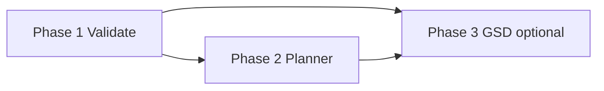

# Roadmap: Chat agent — first-party app capabilities

**Status:** Active — promoted as **Phases 25–27** in [`.planning/ROADMAP.md`](../.planning/ROADMAP.md) (Phase 25 = Validate builtins, 26 = Planner tools, 27 = optional GSD bridge).  
**Scope:** Extend the **builtin agent** (`lib/builtin-agent-tools.js`, `lib/tool-call-handler.js`, `/api/chat` in `server.js`) so the model can invoke the same **Validate** and **Planner** behaviors users get from the UI, with optional later **GSD** read-only helpers.  
**Principles:** Reuse `lib/` entry points already used by HTTP routes; do not fork prompts; align security, aborts, and timeouts with existing chat and API patterns.

**Milestone mapping:** This file’s “Phase 1 / 2 / 3” correspond to **ROADMAP Phase 25 / 26 / 27** respectively.

---

## Problem statement

Today, chat agent tools cover terminal, office export, and MCP. **Validate mode** and **Planner mode** already exist as UI + REST (`POST /api/validate/scan`, `POST /api/validate/generate`; `POST /api/score` with `mode: "planner"`). Users in **Chat** cannot ask the agent to “run the same validate scan” or “score this plan” without duplicating logic or hand-copying API calls. This roadmap phases wiring those capabilities through **builtin tools** (and optional Settings toggles) without reimplementing `lib/validate.js`, scoring prompts, or GSD semantics in a second place.

---

## Phases (summary checklist)

- [x] **Phase 1: Validate builtins** — Agent can trigger project scan and `validate.md`-style generation consistent with Validate mode APIs; optional write to an allowed path under the project folder. (complete 2026-04-09)
- [x] **Phase 2: Planner tool(s)** — Agent can submit planner-shaped content for scoring (and optionally draft/revise flows) consistent with `PlannerPanel` + `/api/score` for `planner`. (complete 2026-04-09)
- [ ] **Phase 3 (optional): GSD bridge builtins** — Thin, allowlisted wrappers around `lib/gsd-bridge.js` for read-only or safe planning queries; strict command allowlist and config gates.

---

## Phase details

### Phase 1: Validate builtins

**Goal:** From chat, the agent can perform the same **scan** and **command generation** the user gets from Validate mode, using `scanProjectForValidation` and `generateValidateCommand` from `lib/validate.js` (and the same behavioral contract as `POST /api/validate/scan` and `POST /api/validate/generate` in `server.js`).

**Depends on:** Nothing beyond current chat + builtin tool infrastructure.

**Requirements mapping:**

| ID     | Requirement                                                                                                                                                         |
| ------ | ------------------------------------------------------------------------------------------------------------------------------------------------------------------- |
| AAP-01 | Builtin tool(s) call shared `lib/validate.js` functions (or a single internal helper used by both routes and builtins) so scan/generate outputs match the HTTP API. |
| AAP-02 | Paths are resolved only under the configured **project folder** (same validation patterns as file browser / validate routes).                                       |
| AAP-03 | Tool results are shaped for the model (structured summary + enough detail to be useful) without leaking raw filesystem outside scope.                               |
| AAP-04 | Optional: write `validate.md` (or user-specified filename) to a path validated under project root; failures are explicit in the tool result.                        |
| AAP-05 | Optional **Settings**: master or per-capability toggle to enable Validate builtins (default consistent with product stance on agent power).                         |

**Success criteria** (observable):

1. With agent tools enabled and Validate builtins on, a user can ask the chat agent to “scan my project for validate” and receive scan results materially the same as running Validate scan from the UI for the same project folder.
2. The agent can request generation of phased validate command content that matches what **Generate** on the Validate flow would produce for the same inputs.
3. Attempts to target paths outside the allowed project scope fail with a clear error in the tool result (no silent access).
4. If “save to file” is implemented, the file appears under the project folder only, at an allowed relative path, and failed writes do not corrupt unrelated files.

**Plans:** TBD (e.g. `01-01` tool schema + `executeBuiltinTool` wiring + tests).

---

### Phase 2: Planner scoring tool

**Goal:** From chat, the agent can run **Planner** scoring parity with **Planner mode** (`src/components/builders/PlannerPanel.jsx`, `BaseBuilderPanel`), i.e. the same scoring pipeline as `POST /api/score` when `mode` is `planner` (see `lib/builder-schemas.js`, `lib/prompts.js` planner keys, `server.js` score handling).

**Depends on:** Phase 1 is independent; can run in parallel. If both ship together, shared patterns (timeouts, toggles, error surfaces) should match.

**Requirements mapping:**

| ID     | Requirement                                                                                                                                                                      |
| ------ | -------------------------------------------------------------------------------------------------------------------------------------------------------------------------------- |
| AAP-06 | Builtin invokes the same scoring path as HTTP (shared function or direct call with identical inputs/outputs), not a duplicate prompt.                                            |
| AAP-07 | Input schema aligns with planner form fields / `PlannerPanel` expectations so grades and categories match UI scoring.                                                            |
| AAP-08 | Ollama abort and request timeouts follow existing `/api/score` and chat tool-loop behavior (`chatAbortController`, model timeout config).                                        |
| AAP-09 | Optional: second tool or parameters for “draft” / “revise” planner content in line with builder revision tags — only if it reuses the same revision flow semantics as the panel. |
| AAP-10 | Optional **Settings** toggle for Planner agent tools.                                                                                                                            |

**Success criteria** (observable):

1. For the same planner text and project context, scores and category breakdowns from the agent tool match those from Planner mode’s score action (allowing for model nondeterminism within documented bounds).
2. Stopping chat mid-tool cancels in-flight scoring work without leaving the server in a bad state.
3. Oversized inputs fail gracefully (error in tool result), consistent with API limits / token handling elsewhere.

**Plans:** TBD.

---

### Phase 3 (optional): GSD bridge builtins

**Goal:** Optional builtin tool(s) expose **read-only or strictly bounded** GSD operations via `lib/gsd-bridge.js` (same bridge used by Build dashboard), for “what phase are we in?” / “show roadmap snippet” style workflows — **not** a general shell.

**Depends on:** Phase 1–2 recommended complete so agent surface area and Settings patterns are stable; technically can ship independently if tightly scoped.

**Requirements mapping:**

| ID     | Requirement                                                                                                                     |
| ------ | ------------------------------------------------------------------------------------------------------------------------------- |
| AAP-11 | Allowlisted operations only (explicit map of allowed bridge commands or methods); reject everything else at the boundary.       |
| AAP-12 | Project must be registered / path valid per existing GSD expectations (align with Build registry and `gsd-bridge` constraints). |
| AAP-13 | No arbitrary command strings from the model — only structured args validated with the same rigor as server routes.              |
| AAP-14 | **Settings** gate (default off or restricted) for any GSD agent capability.                                                     |

**Success criteria** (observable):

1. With the toggle off, the model cannot invoke GSD bridge tools (tools absent from prompt or execution returns a clear “disabled” result).
2. With the toggle on, only documented operations succeed; fuzzed or out-of-scope requests fail closed.
3. Behavior matches Build mode’s bridge semantics for the same project (no second source of truth).

**Plans:** TBD.

---

## Dependencies between phases

- **Phase 1 → Phase 2:** Soft dependency (shared conventions: toggles, error JSON, tests).
- **Phase 3** depends on stable **Settings** + security patterns from 1–2 and on `gsd-bridge` remaining the single integration point.

---

## Risks and mitigations

| Risk                                                                                                           | Mitigation                                                                                                                                     |
| -------------------------------------------------------------------------------------------------------------- | ---------------------------------------------------------------------------------------------------------------------------------------------- |
| **Ollama timeouts / slow models** — Validate scan may be fast; **generate** and **planner score** hit the LLM. | Reuse existing `reviewTimeout`-style and chat score timeouts; surface partial errors in tool results; respect abort signals.                   |
| **Token / context limits** — Scan output or planner body may exceed model context when echoed back.            | Truncate or summarize in the tool layer with explicit “truncated” flags; align with how APIs cap payload size today.                           |
| **Duplicate prompts / drift**                                                                                  | Mandated: one code path from `lib/prompts.js` / score pipeline; builtins call shared helpers used by `server.js`.                              |
| **Path traversal / data exfil**                                                                                | Only `config.projectFolder`-relative resolution; reuse `isWithinBasePath` / file-browser validation; never pass raw user paths without checks. |
| **Electron vs web**                                                                                            | Project folder and `CC_DATA_DIR` behavior must match Validate/Build; manual check on packaged app if paths differ from browser.                |
| **Agent loop abuse** — Many tool rounds burning CPU.                                                           | Existing max tool rounds + rate limits; optional stricter limits for heavy tools.                                                              |
| **GSD phase 3** — Arbitrary process execution if mis-wired.                                                    | No shell; allowlist only; default off; audit `gsd-bridge` entry points before exposing.                                                        |

---

## Verification (suggested)

| Layer           | Phase 1                                                                                                                                              | Phase 2                                                                       | Phase 3                                           |
| --------------- | ---------------------------------------------------------------------------------------------------------------------------------------------------- | ----------------------------------------------------------------------------- | ------------------------------------------------- |
| **Unit**        | Mock `validate.js` / assert builtin handler calls correct functions and rejects bad paths.                                                           | Assert planner tool builds same payload as score route; Zod/schema alignment. | Assert allowlist rejects unknown operations.      |
| **Integration** | `POST /api/chat` (or handler unit with fake Ollama) with tool call invoking validate builtin; compare JSON to `/api/validate/*` for fixture project. | Same for score: compare builtin result to `/api/score` for planner fixture.   | Integration test with temp project + bridge mock. |
| **Manual**      | Chat: “Scan my project for validate” with known repo; compare to Validate UI.                                                                        | Chat: score a short planner doc; compare to Planner panel.                    | Toggle off/on; attempt disallowed operation.      |

Existing tests to extend or mirror: `tests/unit/builtin-agent-tools.test.js`, `tests/unit/tool-call-handler.test.js`, integration patterns in `docs/TESTING.md`.

---

## Coverage summary

| Requirement     | Phase |
| --------------- | ----- |
| AAP-01 – AAP-05 | 1     |
| AAP-06 – AAP-10 | 2     |
| AAP-11 – AAP-14 | 3     |

**Coverage:** 14/14 mapped; each requirement appears in exactly one phase.

---

## Related code (reference only)

- Agent pipeline: `lib/tool-call-handler.js`, `lib/builtin-agent-tools.js`, `server.js` (`/api/chat`).
- Validate: `lib/validate.js`, validate routes in `server.js`.
- Planner UI: `src/components/builders/PlannerPanel.jsx`; score: `POST /api/score`, `lib/builder-schemas.js`, `lib/prompts.js`.
- GSD: `lib/gsd-bridge.js`, Build dashboard consumers.

---

## Document history

| Date       | Change                                                                     |
| ---------- | -------------------------------------------------------------------------- |
| 2026-04-04 | Initial roadmap (agent app capabilities: Validate, Planner, optional GSD). |
