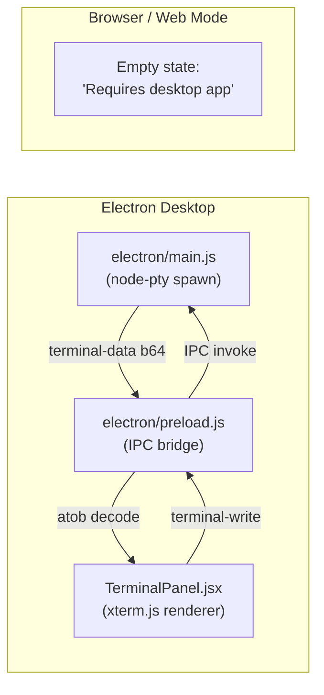

# Terminal Mode — Feature Spec

## User Story

As a vibe coder using Code Companion on the desktop, I want an integrated terminal panel in the app so I can run shell commands, test scripts, and inspect my project without switching to a separate Terminal window.

## Architecture

## How It Works

1. User clicks **Terminal** in the mode sidebar.
2. `TerminalPanel` detects `window.electronAPI.terminal` — present only in the Electron build.
3. On mount, calls `api.start(cwd)` with the active File Browser folder (`chatFolder || projectFolder` from App state) → IPC → `electron/main.js` validates the path is an existing directory (`fs.statSync(p).isDirectory()`); if missing or invalid, falls back to `cfg.chatFolder`, then `cfg.projectFolder`, then `$HOME`. Spawns a PTY (`node-pty`) at the resolved CWD using `$SHELL` (or `cmd.exe` on Windows). The `useEffect` deps include `projectFolder` so changing the File Browser folder respawns the PTY at the new location.
4. PTY output is base64-encoded and sent to the renderer via `win.webContents.send('terminal-data', ...)`.
5. `TerminalPanel` decodes it (`atob`) and writes to the `xterm.js` terminal.
6. User keystrokes go the reverse direction: `term.onData → api.write → IPC → pty.write`.
7. A `ResizeObserver` on the container calls `fitAddon.fit()` and sends `terminal-resize` whenever the panel changes size.

## Non-Goals (v1)

- No PTY over HTTPS/WebSocket for remote or browser users — too large a security surface.
- No multi-tab support — one PTY per window.
- No persistent session across app restarts — each Terminal mode open starts a fresh shell.

## Security

| Concern                                | Mitigation                                                                                                                                                                                                                                                                          |
| -------------------------------------- | ----------------------------------------------------------------------------------------------------------------------------------------------------------------------------------------------------------------------------------------------------------------------------------- |
| Arbitrary path injection from renderer | Renderer suggests `cwd`; `main.js` validates it's an existing directory before honoring it. Falls back to `cfg.chatFolder` → `cfg.projectFolder` → `$HOME`. (Once a shell is running the user can `cd` anywhere their `$SHELL` permits, so the gate constrains _initial_ CWD only.) |
| Unrestricted shell access              | Terminal mode is desktop-only; no LAN exposure                                                                                                                                                                                                                                      |
| Zombie processes                       | PTY killed on `mainWindow.on('close')` and on `terminal-kill` IPC                                                                                                                                                                                                                   |

## Difference from Agent Terminal

|              | **Terminal mode** (this feature) | **Agent terminal** (`run_terminal_cmd`) |
| ------------ | -------------------------------- | --------------------------------------- |
| Initiated by | Human user                       | AI agent                                |
| Interface    | Full interactive PTY (xterm.js)  | One-shot stdout/stderr capture          |
| Allowlist    | None — full shell access         | Yes — configured in Settings            |
| Output       | Streamed to terminal panel       | Included in AI response                 |

## Testing Checklist

- [ ] Open Terminal mode in Electron dev (`npm run electron:dev`) → shell prompt appears
- [ ] `pwd` matches the folder shown in the File Browser
- [ ] Navigate to a different folder in the File Browser → switch to Terminal → `pwd` reflects the new folder (PTY respawned)
- [ ] Type `ls` and press Enter → directory listing renders with colors
- [ ] Type a command that produces ANSI colors (e.g. `ls -G`) → colors render correctly
- [ ] Resize the app window → terminal reflows to new column width
- [ ] Switch to another mode and back → new PTY starts cleanly
- [ ] Close the app window → no zombie PTY processes (`ps aux | grep pty`)
- [ ] Open app in browser (non-Electron) → Terminal mode shows "desktop app required" empty state, no errors
- [ ] Packaged build → terminal works in `.dmg` install
